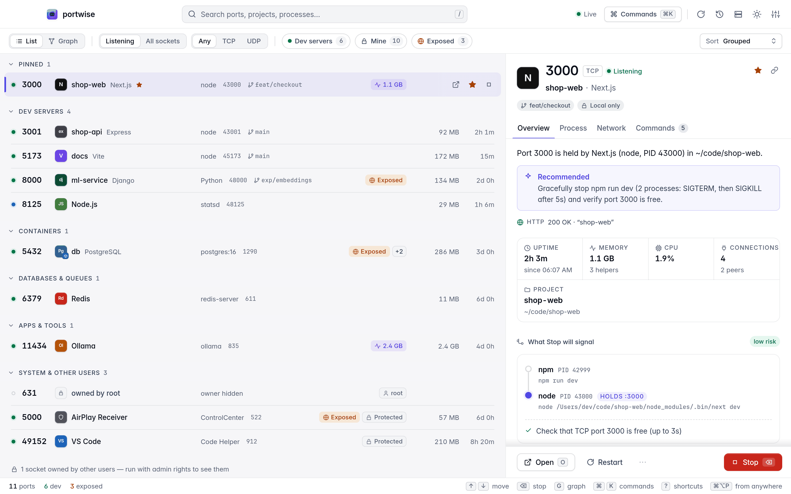
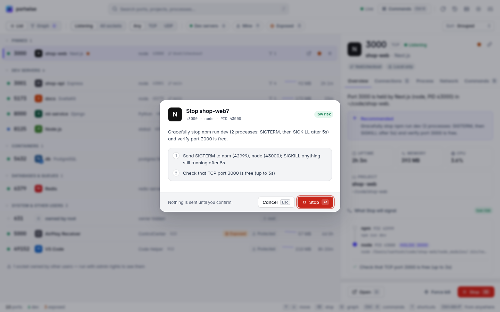
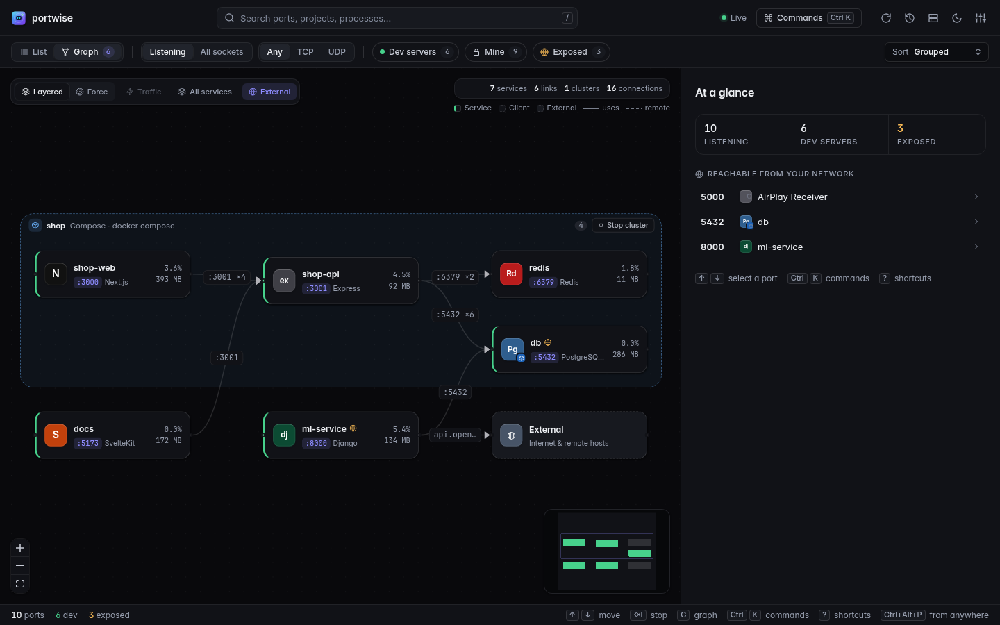
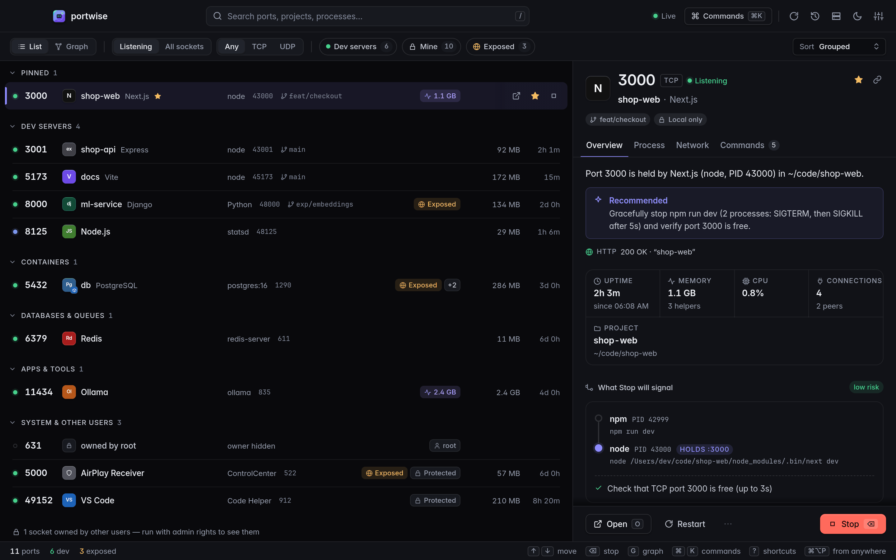
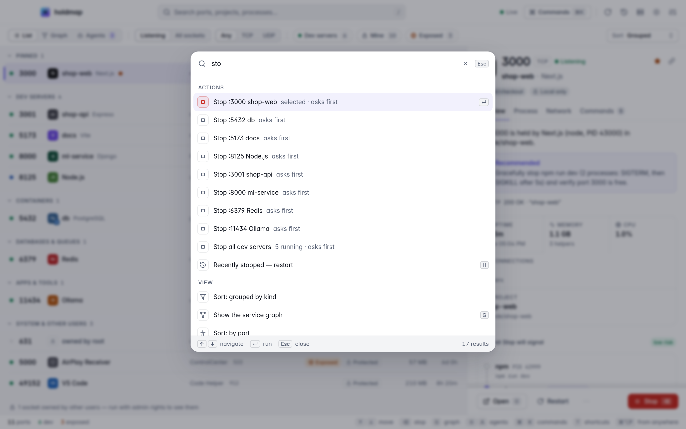
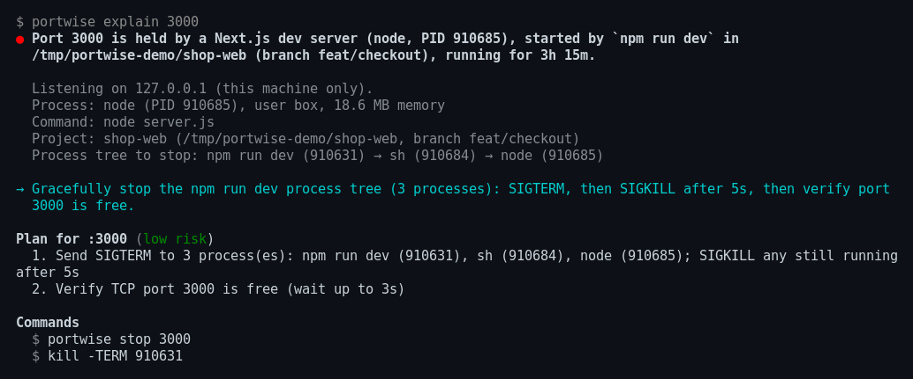
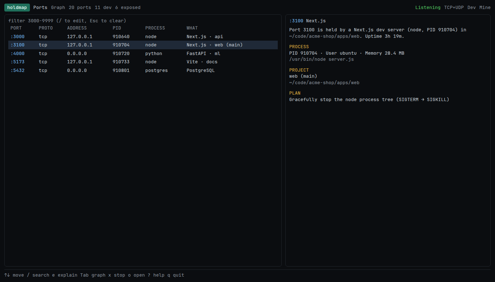

<p align="center">
  
</p>

<h1 align="center">portwise</h1>

<p align="center">
  <b>See which ports are in use, why they're busy, and stop the right thing safely.</b><br/>
  One Rust core, four surfaces: CLI · TUI · desktop and tray app · MCP server for AI coding assistants.
</p>

<p align="center">
  <a href="https://github.com/santoshshinde2012/portwise/actions/workflows/ci.yml"></a>
  <a href="#licence"></a>
  
  
</p>

<p align="center">
  
</p>

---

`EADDRINUSE: address already in use :::3000`. Most tools answer with a PID and a `kill -9`.
portwise answers the questions you actually have:

- **Who owns it?** The process, PID, user, command line and working directory, plus the **project
  name, git branch and framework** (Next.js, Vite, SvelteKit, Django, FastAPI, Rails, Postgres,
  Redis…), or the **Docker, OrbStack, Colima or Podman container** that published it.
- **Why is it busy?** A plain-English explanation: a dev-server process tree (`npm → sh → node`),
  a container, a systemd, pm2 or Homebrew service, an OS feature (AirPlay Receiver on 5000/7000,
  Windows HTTP.sys or an excluded port range), `TIME_WAIT`, or another user's process.
- **What should I do?** A plan you can preview: stop the whole dev-server tree gracefully (SIGTERM,
  then SIGKILL after a grace period), stop the container through its runtime, or run
  `brew services stop` / `systemctl --user stop`. Afterwards portwise **checks the port is free**.
- **What depends on it?** A live **service graph** showing which local services talk to which
  (web → api → db), grouped into clusters (Compose project, Kubernetes namespace, pm2/turbo/nx
  parent, workspace, git repo), with port-forwards and tunnels (kubectl, `ssh -L`, cloudflared,
  ngrok). **Stop a whole cluster** in dependency order with one confirmed plan.

## Contents

- [Screenshots](#screenshots)
- [Install](#install)
- [Quick start](#quick-start)
- [CLI](#cli)
- [Project stacks and the shell hook](#project-stacks-and-the-shell-hook)
- [TUI](#tui)
- [Desktop and tray app](#desktop-and-tray-app)
- [MCP server](#mcp-server)
- [Safety model](#safety-model)
- [Platform support](#platform-support)
- [Contributing](#contributing)
- [Licence](#licence)

## Screenshots

| Explain, then act | Service graph |
|---|---|
|  |  |
| **Dark theme** | **Command palette** |
|  |  |
| **`portwise explain 3000`** | **TUI** |
|  |  |

## Install

### Command-line tool (no Rust needed)

macOS and Linux:

```sh
curl --proto '=https' --tlsv1.2 -LsSf https://github.com/santoshshinde2012/portwise/releases/latest/download/portwise-installer.sh | sh
```

Windows (PowerShell):

```powershell
powershell -ExecutionPolicy Bypass -c "irm https://github.com/santoshshinde2012/portwise/releases/latest/download/portwise-installer.ps1 | iex"
```

The binary goes to `~/.local/bin` (`%USERPROFILE%\.local\bin` on Windows; v0.1.0 used
`~/.cargo/bin`); `PORTWISE_INSTALL_DIR=DIR` overrides it. If that folder is already on your
`PATH`, `portwise` works straight away. If not, the installer adds it for new shells (a line that
sources `~/.config/portwise/env.sh` in `~/.profile`, `~/.zshrc` and any existing `~/.bashrc` /
`~/.bash_profile`, plus a fish `conf.d` file; the user `PATH` on Windows) and says so: open a new
terminal, or run the `source` command it prints.

Homebrew: coming soon (the tap isn't published yet).

**Troubleshooting**

- **`command not found: portwise` right after installing:** the folder wasn't on `PATH` yet.
  Open a new terminal, or run `source "$HOME/.config/portwise/env.sh"` (v0.1.0:
  `source "$HOME/.cargo/env"`).
- **`Permission denied` on `~/.bash_profile`, `mkdir: ~/.config/fish/conf.d` or `ERROR: command
  failed`:** the binary is already installed; only the `PATH` edits failed, usually because an
  old `sudo` left those files owned by root. Give them back with
  `sudo chown "$USER" ~/.bash_profile` and `sudo chown -R "$USER" ~/.config/fish` and run the
  installer again, or skip the edits with `curl … | PORTWISE_NO_MODIFY_PATH=1 sh` and add the
  folder to `PATH` yourself (e.g. `export PATH="$HOME/.local/bin:$PATH"` in `~/.zshrc`).
- **Never run the installer with `sudo`.** It installs for your user only, and running it as
  root is what creates root-owned files in your home folder.
- **Upgrading from v0.1.0:** delete the old `~/.cargo/bin/portwise` so it can't shadow the new
  one in `~/.local/bin` (`command -v portwise` shows which one runs).

**Or download it yourself** from the [latest release](https://github.com/santoshshinde2012/portwise/releases/latest).
Pick your archive (`aarch64-apple-darwin` for Apple silicon, `x86_64-apple-darwin` for Intel
Macs, `x86_64-unknown-linux-gnu` / `-musl` / `aarch64-unknown-linux-gnu` for Linux,
`x86_64-pc-windows-msvc.zip` for Windows), then check it and put the binary on your `PATH`:

```sh
f=portwise-aarch64-apple-darwin.tar.xz
base=https://github.com/santoshshinde2012/portwise/releases/latest/download
curl -LO "$base/$f" -LO "$base/$f.sha256"
shasum -a 256 -c "$f.sha256"     # Linux: sha256sum -c; macOS also warns about a blank line, the OK is what counts
gh attestation verify "$f" --repo santoshshinde2012/portwise   # optional: built by this repo's CI
tar xf "$f" && mkdir -p ~/.local/bin && mv "${f%.tar.xz}/portwise" ~/.local/bin/
```

(If `~/.local/bin` isn't on your `PATH`, add `export PATH="$HOME/.local/bin:$PATH"` to your
shell's rc file.)

### Desktop app

| Platform | Download |
|---|---|
| macOS, Apple silicon | [portwise_aarch64.dmg][dmg-arm64] |
| macOS, Intel | [portwise_x64.dmg][dmg-x64] |
| Windows | [.msi][msi] or [setup .exe][nsis] |
| Linux | [.AppImage][appimage], [.deb][deb] or [.rpm][rpm] |

<!-- release-please bumps these (one version per line; the rpm's "-" is %2D so its "-1" release
     suffix isn't read as part of the version). -->
<!-- x-release-please-start-version -->
[dmg-arm64]: https://github.com/santoshshinde2012/portwise/releases/latest/download/portwise_0.1.0_aarch64.dmg
[dmg-x64]: https://github.com/santoshshinde2012/portwise/releases/latest/download/portwise_0.1.0_x64.dmg
[msi]: https://github.com/santoshshinde2012/portwise/releases/latest/download/portwise_0.1.0_x64_en-US.msi
[nsis]: https://github.com/santoshshinde2012/portwise/releases/latest/download/portwise_0.1.0_x64-setup.exe
[appimage]: https://github.com/santoshshinde2012/portwise/releases/latest/download/portwise_0.1.0_amd64.AppImage
[deb]: https://github.com/santoshshinde2012/portwise/releases/latest/download/portwise_0.1.0_amd64.deb
[rpm]: https://github.com/santoshshinde2012/portwise/releases/latest/download/portwise-0.1.0%2D1.x86_64.rpm
<!-- x-release-please-end -->

The installers aren't notarised or Authenticode-signed yet, so the OS asks once:

- **macOS** says Apple "could not verify" portwise (or that it's from an unidentified developer).
  Drag it to Applications, try to open it once, then choose **System Settings > Privacy &
  Security > Open Anyway** (macOS 14 and earlier: right-click the app > **Open**). Or clear the
  download flag: `xattr -dr com.apple.quarantine /Applications/portwise.app`. (v0.1.0's app
  could be reported as "damaged"; that's fixed from 0.1.1, which is ad-hoc signed.)
- **Windows** SmartScreen shows "Windows protected your PC": click **More info**, then **Run anyway**.

Each release lists SHA-256 checksums (`portwise-desktop-*.sha256`) and build provenance for every
installer.

### Build from source

You need Rust (the repo's `rust-toolchain.toml` picks the stable toolchain; 1.95 is the minimum)
and a C toolchain: `xcode-select --install` on macOS, `sudo apt-get install -y build-essential`
on Debian/Ubuntu, the Visual Studio C++ build tools on Windows.

```sh
curl --proto '=https' --tlsv1.2 -sSf https://sh.rustup.rs | sh   # Windows: run rustup-init.exe from rustup.rs
source "$HOME/.cargo/env"
git clone https://github.com/santoshshinde2012/portwise && cd portwise
cargo install --locked --path crates/portwise-cli               # installs portwise into ~/.cargo/bin
```

Or, without cloning: `cargo install --locked --git https://github.com/santoshshinde2012/portwise portwise`.

The desktop app also needs Node.js 20.19+ or 22.12+ (and, on Linux, the WebKitGTK libraries); see
[Desktop and tray app](#desktop-and-tray-app).

### Check it works

```sh
portwise --version
portwise list
```

Optional extras:

- Shell completions, e.g. zsh: `mkdir -p ~/.zfunc && portwise completions zsh > ~/.zfunc/_portwise`,
  then add `fpath=(~/.zfunc $fpath); autoload -U compinit && compinit` to `~/.zshrc`. Bash:
  `portwise completions bash > ~/.local/share/bash-completion/completions/portwise`. Fish:
  `portwise completions fish > ~/.config/fish/completions/portwise.fish` (also powershell, elvish).
- The shell hook: add `eval "$(portwise init zsh)"` to `~/.zshrc` (see
  [the shell hook](#project-stacks-and-the-shell-hook)).
- Man pages: `portwise man --out-dir DIR`.

### Uninstall

Delete the binary (`rm ~/.cargo/bin/portwise` for v0.1.0, `rm ~/.local/bin/portwise` for later
releases, or `cargo uninstall portwise` if you built it with cargo) and the installer's receipt,
`~/.config/portwise/portwise-receipt.json` (`%LOCALAPPDATA%\portwise\portwise-receipt.json` on
Windows). Remove the line the installer added to your shell rc files (`. "$HOME/.cargo/env"` if
nothing else uses `~/.cargo/bin`, or `. "$HOME/.config/portwise/env.sh"`). Remove
the desktop app the usual way for your OS (drag it to the Trash; Settings > Apps on Windows;
`sudo apt remove portwise` / `sudo dnf remove portwise` on Linux). Your settings and history live
in the configuration directory (see [Desktop and tray app](#desktop-and-tray-app)); delete it to
remove them too.

## Quick start

```sh
portwise                     # open the interactive TUI
portwise list --dev          # just the dev servers
portwise explain 3000        # who holds 3000, why, and what to do about it
portwise stop 3000 --dry-run # the exact plan, without doing anything
portwise stop 3000           # stop it gracefully and check the port is free
portwise run -p 3000 -- npm run dev   # free 3000 safely, then start your server on it
```

## CLI

Every command, flag and default is in the generated **[CLI reference](docs/cli.md)**. The
highlights:

| Command | What it does |
|---|---|
| `portwise` | Opens the TUI when run in a terminal (also `portwise tui`) |
| `portwise list [QUERY]` (alias `ls`) | Listening ports. `--all` every socket, `--dev`, `--mine`, `--exposed`, `--tcp`, `--udp`, `--range 3000-3999`, `--sort memory`, `--http` (status and page title), `--wide`, `--json` |
| `portwise inspect 3000` | Everything about a port: owner, process tree, project, plan |
| `portwise explain 3000` (alias `why`) | Why is 3000 busy, and what should I do? |
| `portwise stop 3000` | Gracefully stop whatever holds 3000, then check it is free. `--dry-run`, `--yes`, `--timeout 10s`, `--no-tree`, `--allow-protected` |
| `portwise stop pid:1234 vite` | Stop by PID or process name (also `--pid`, `--name`) |
| `portwise stop --cluster shop` | Stop a whole cluster, dependents first (also `stop cluster:shop`) |
| `portwise stop --all-dev` | Stop every dev server of yours in one confirmed plan (protected processes and containers are skipped) |
| `portwise kill 3000` | Force-kill now (SIGKILL / TerminateProcess), same as `stop --force` |
| `portwise free-port --near 3000` | Print a free TCP port (`--range`, `--count 3`) |
| `portwise wait 5432 --timeout 30s` | Wait until something accepts connections (`--free` waits until it's free) |
| `portwise run -p 3000 -- npm run dev` | Free the port safely, then run the command with `PORT=3000` (`--fallback` picks the next free port instead) |
| `portwise up [SERVICE…]` | Start the services in `.portwise.toml` in dependency order and wait until each accepts connections (`--replace` stops a conflicting holder first) |
| `portwise down [SERVICE…]` | Stop the project's services, dependents first (`--dry-run`, `--all`) |
| `portwise status` | Each service's state, PID and HTTP health; exits `1` unless all are up |
| `portwise init [SHELL]` | Write a `.portwise.toml` from the dev servers running here, or print the shell hook for zsh, bash, fish or pwsh |
| `portwise graph` (alias `mesh`) | The service graph as a tree. `--json`, `--dot`, `--mermaid`, `--cluster NAME`, `--no-external`, `--all` |
| `portwise watch` | Stream new, closed and conflicting listeners (`--json` for NDJSON) |
| `portwise pin 3000 --label web` | Pin a port: shown first and watched even when free |
| `portwise unpin 3000` | Remove a pin |
| `portwise pins` | List pinned ports and whether they're in use |
| `portwise history` | What portwise stopped, with the command and directory (`--clear`) |
| `portwise restart 3000` | Stop what holds 3000 and start the same command again, or re-run it from history |
| `portwise open 3000` | Open `http://localhost:3000` (`--print` just prints the URL) |
| `portwise ssh devbox [graph]` | Another machine's ports over SSH: read-only, nothing to install remotely |
| `portwise mcp` | The MCP server on stdio, for AI coding assistants |
| `portwise completions zsh` | Shell completions: bash, zsh, fish, powershell, elvish |
| `portwise man` | The man page (`--out-dir DIR` writes one page per command) |

**Queries.** `list` and the search boxes understand `:3000` (exact port), `3000-3999` (range),
`proto:udp`, `pid:123`, `user:me` and free text (`next`, `shop-web`, a branch name).

**Scripting.** Every read command takes `--json`. Exit codes are `0` ok, `1` busy, not found or
timed out, `2` error, `3` blocked by the safety policy, and `4` needs elevation. Colour follows
`--color auto|always|never` (or `PORTWISE_COLOR`), `NO_COLOR` and `CLICOLOR_FORCE`. `--no-docker`
skips the container runtimes. `portwise list | head` doesn't print "broken pipe" errors.

## Project stacks and the shell hook

A `.portwise.toml` at the project root (found by walking up from the current directory) names
the ports a project uses. `portwise init` writes one from what's running; edit it to add
commands:

```toml
name = "shop"
protect = [5432]                    # `stop` refuses these without --allow-protected

[services.db]
port = 5432                         # no command: started elsewhere, so up only checks it

[services.api]
port = 4000
command = "npm run dev"             # run with PORT set, logs in <config dir>/logs/
cwd = "api"
depends_on = ["db"]
health = "/healthz"                 # shown by `portwise status`

[services.web]
port = 3000
command = "npm run dev"
cwd = "web"
env = { API_URL = "http://localhost:4000" }
depends_on = ["api"]
```

`portwise up` starts what isn't running, `portwise status` shows the stack and `portwise down`
stops it. Only processes started from the project (or its Compose project) count as its own; a
different program on one of its ports is reported as a conflict, never stopped silently.

Add `eval "$(portwise init zsh)"` to `~/.zshrc` (or `bash`, `fish | source`,
`portwise init pwsh | Out-String | Invoke-Expression`). When a dev-server command fails because
its port is taken, the hook prints who holds it and the command to free it. It never stops
anything itself.

## TUI

`portwise` (or `portwise tui`) opens a keyboard-first terminal UI with search, filters, sorting,
a details pane and a service-graph tab. The footer shows the keys that matter right now and `?`
lists them all. The essentials: `/` search, `Enter` explain, `x` stop (after a confirmation that
shows the plan), `X` force kill, `o` open in the browser, `c` copy the URL, `Tab` switch to the
graph, `C` stop the selected cluster, `q` quit.

## Desktop and tray app

A Tauri v2 and Svelte 5 app in `apps/desktop`. It lives in the tray or menu bar when its window is
closed, notifies you about new and conflicting listeners, and can launch at login. It has the
list (grouped by kind or by cluster), a details pane, the stop flow with live progress, the
service graph (`g`), pins, history with one-click restart, remote machines over SSH and a
command palette (`⌘K` / `Ctrl+K`). Press `?` in the app for every shortcut.

```sh
cd apps/desktop
npm install
npm run tauri dev       # the app with hot reload
npm run tauri build     # a release build plus installers for your OS
npm run dev             # just the UI in a browser at http://localhost:1420, with mock data
```

Linux needs the WebKitGTK and tray libraries first:
`sudo apt-get install -y libwebkit2gtk-4.1-dev libayatana-appindicator3-dev librsvg2-dev libxdo-dev libssl-dev`.

The CLI, TUI and desktop app share one configuration directory (`~/.config/portwise` on Linux,
`~/Library/Application Support/portwise` on macOS, `%APPDATA%\portwise` on Windows, or
`$PORTWISE_HOME`) holding `config.json` (pins and settings), `history.jsonl` and `logs/`.

## MCP server

`portwise mcp` speaks the [Model Context Protocol](https://modelcontextprotocol.io) over stdio, so
AI coding assistants can list ports, explain why one is busy, find a free port, wait for a server,
read the service graph and stop their own dev servers. Tools: `list_ports`, `explain_port`,
`find_free_port`, `wait_for_port`, `get_topology`, `plan_cluster_stop` (always a dry run) and
`stop_port` (low-risk owners only unless `allow_non_dev`; protected processes and other users'
processes are always refused).

Claude Desktop (`claude_desktop_config.json`) and Cursor (`~/.cursor/mcp.json`):

```json
{
  "mcpServers": {
    "portwise": { "command": "portwise", "args": ["mcp"] }
  }
}
```

VS Code (`.vscode/mcp.json`) uses `"servers"` with `"type": "stdio"` instead. If the client can't
find `portwise`, give the absolute path (for example `~/.local/bin/portwise`, or `~/.cargo/bin/portwise` for v0.1.0).

## Safety model

portwise kills processes, so the rules are strict and live in one place (`portwise-core`); every
surface behaves the same.

- **Graceful by default.** SIGTERM (on Windows, `taskkill` without `/F`), then SIGKILL or
  `TerminateProcess` after the grace period (`--timeout`, default 5 s).
- **Stop the right thing.** It climbs to the dev-server tree root (`npm`, `sh -c`, `nodemon`,
  `uvicorn --reload`…) so the launcher can't respawn the child. Containers stop through their
  runtime, supervised services through their supervisor.
- **Protected processes.** PID 1, core OS processes and portwise's own process tree are never
  stopped. System services, shells, terminals, IDEs and AI-assistant hosts are refused unless you
  pass `--allow-protected` (the MCP server always refuses).
- **PID-reuse guard.** Each plan pins processes by start time and re-checks before signalling
  (race-free with `pidfd` on Linux).
- **Dry run and verification.** `--dry-run` shows the exact plan; afterwards portwise checks the
  port is free and tells you if a supervisor brought it back.
- **Local and private.** No telemetry, and no network access beyond the local container runtime
  and SSH connections you ask for.

Sockets owned by other users need `sudo` (or an elevated terminal on Windows); portwise counts
them instead of hiding them, and exits with code `4`.

## Platform support

| | Linux | macOS | Windows |
|---|---|---|---|
| Socket → PID | `/proc` | libproc | `GetExtendedTcpTable` / `GetExtendedUdpTable` |
| PID-reuse guard | start time and pidfd | start time | creation time |
| Graceful stop | SIGTERM → SIGKILL | SIGTERM → SIGKILL | `taskkill` → `TerminateProcess` |
| Supervisors | systemd, pm2 | Homebrew services, pm2 | services reported as protected |
| Containers | Docker, Podman | Docker Desktop, OrbStack, Colima, Rancher Desktop, Podman | Docker Desktop |
| CLI, TUI, MCP, desktop | ✅ | ✅ | ✅ |

## Contributing

Contributions are welcome. See [CONTRIBUTING.md](CONTRIBUTING.md) for setup, checks and
conventions, [docs/architecture.md](docs/architecture.md) for how the pieces fit together,
[SECURITY.md](SECURITY.md) for reporting vulnerabilities and [CHANGELOG.md](CHANGELOG.md) for
release notes.

## Licence

Licensed under either of the [Apache License, Version 2.0](LICENSE-APACHE) or the
[MIT license](LICENSE-MIT), at your option. Unless you explicitly state otherwise, any contribution
you intentionally submit for inclusion in this work, as defined in the Apache-2.0 licence, is dual
licensed as above, without any additional terms or conditions.

The desktop app bundles Inter and JetBrains Mono under the SIL Open Font License 1.1 (see
`apps/desktop/src/assets/fonts/`).
