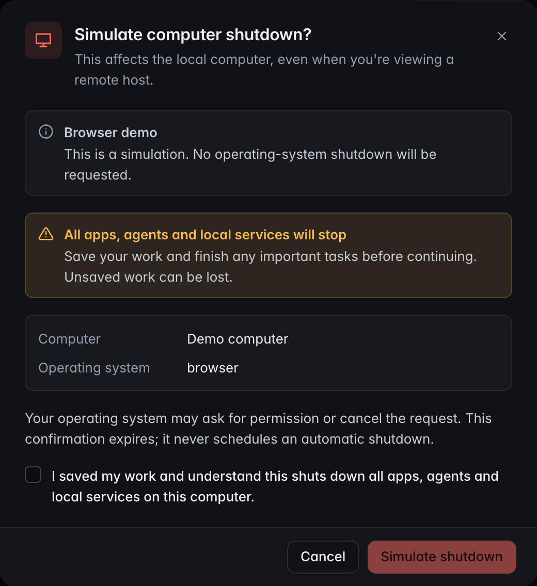
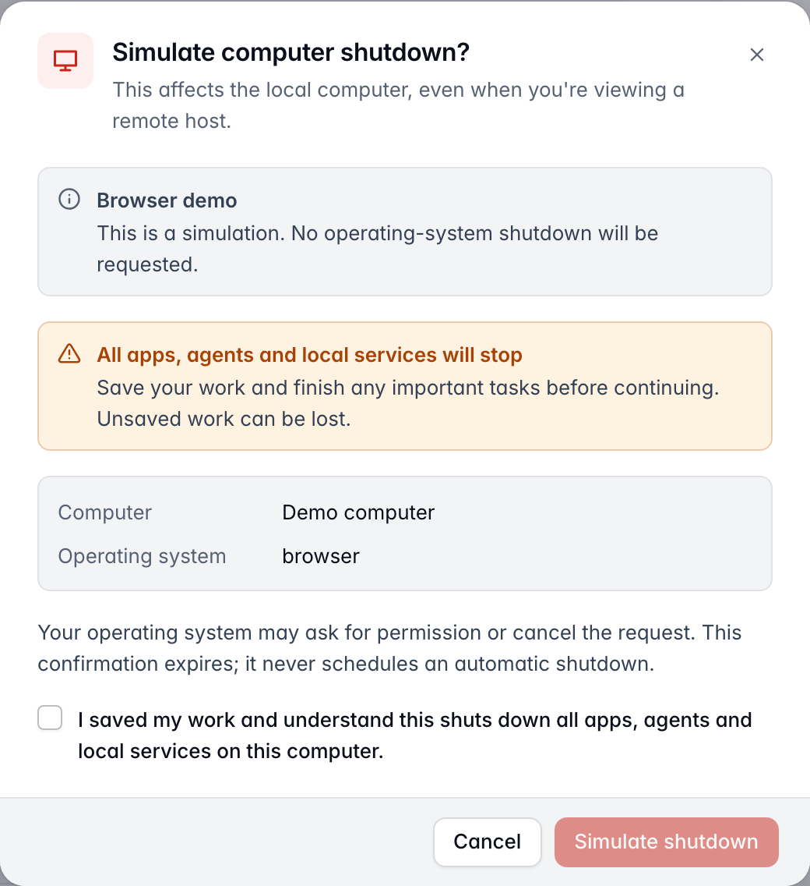
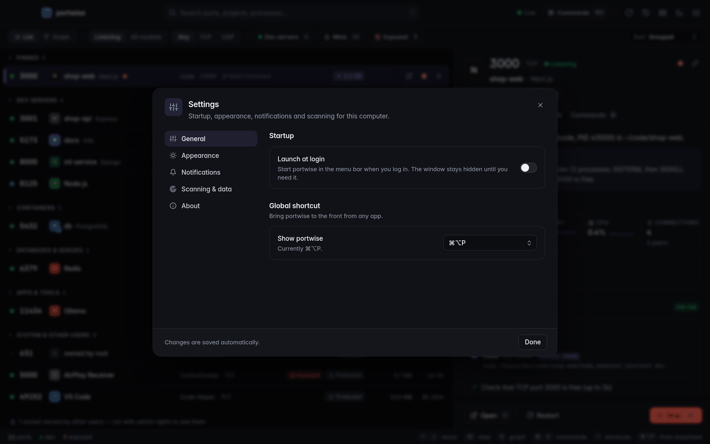
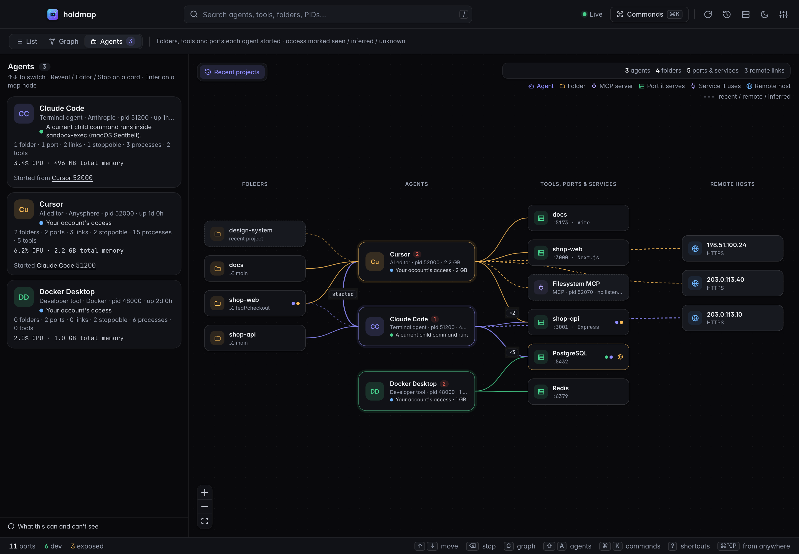
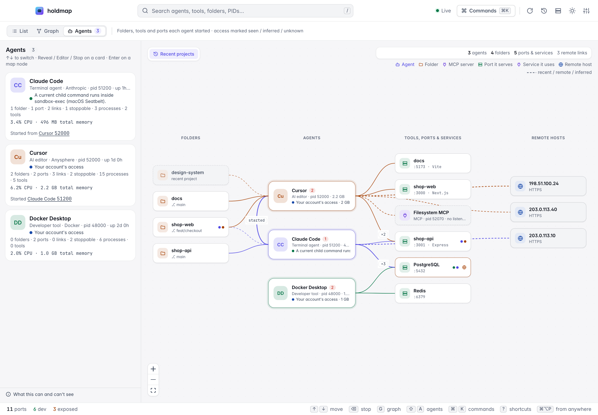
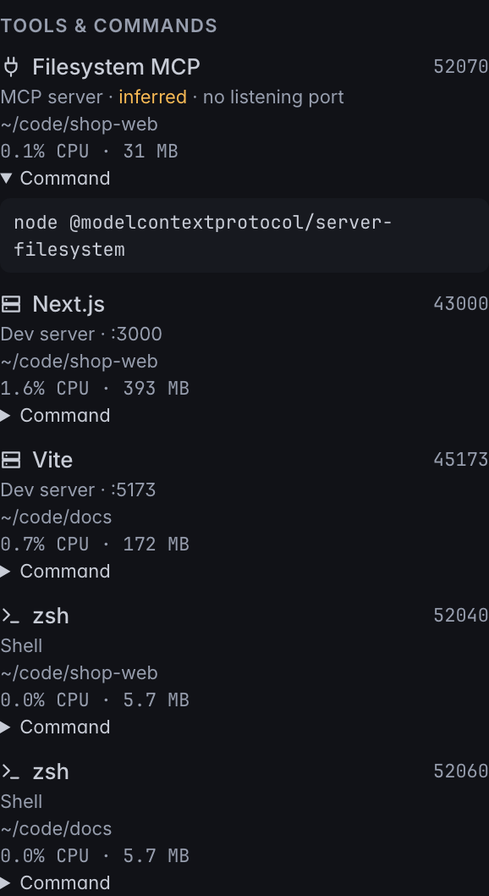
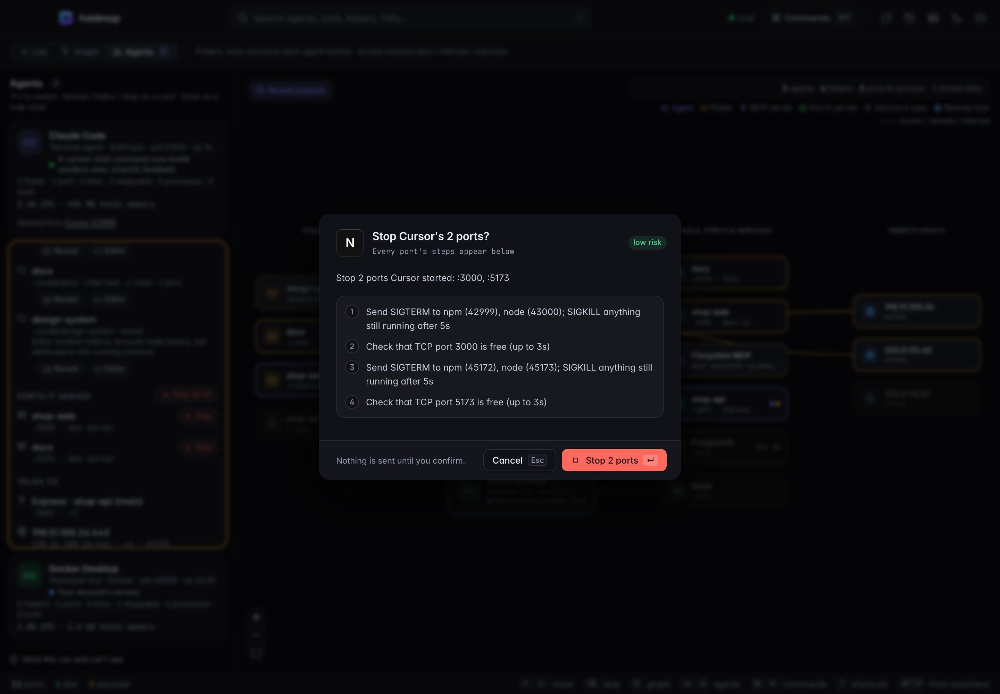
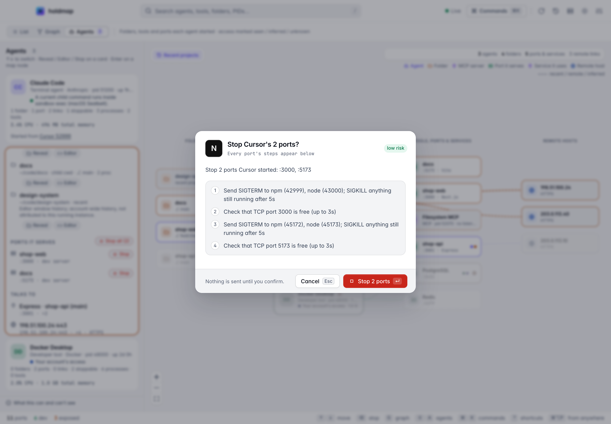
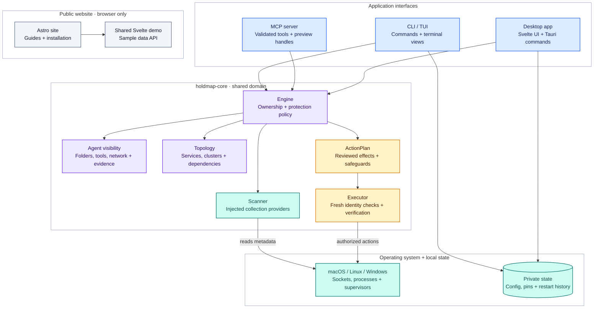

<p align="center">
  
</p>

<h1 align="center">holdmap</h1>

<p align="center">
  <b>See which ports, agents and tools are running — and stop the right thing safely.</b><br/>
  CLI · TUI · desktop and tray app · MCP server, all on one Rust core.
</p>

<p align="center">
  <a href="https://santoshshinde2012.github.io/holdmap/"><b>Website</b></a> ·
  <a href="https://santoshshinde2012.github.io/holdmap/#demo">Live demo</a> ·
  <a href="https://santoshshinde2012.github.io/holdmap/docs/">Guide</a>
</p>

<p align="center">
  <a href="https://github.com/santoshshinde2012/holdmap/actions/workflows/ci.yml"></a>
  <a href="https://github.com/santoshshinde2012/holdmap/releases/latest"></a>
  <a href="#license"></a>
  
</p>

<p align="center">
  <picture>
    <source media="(prefers-color-scheme: dark)" srcset="docs/screenshots/desktop-overview-dark.png" />
    
  </picture>
</p>

`EADDRINUSE: address already in use :::3000`? Most tools hand you a PID and a `kill -9`.
holdmap tells you what's really there — which agent or tool started it — and stops only what
it should.

The README and screenshots describe the current source. Child-tool metadata and search, MCP
resources/prompts, freshness improvements and security hardening are [Unreleased](CHANGELOG.md#unreleased); build
this checkout to use them. The download links below remain for **0.3.0**. Desktop screenshots
use the shared browser UI with sample data.

## Features

- **Who owns the port.** Process, user, command, folder, plus the project, git branch and
  framework (Next.js, Vite, Django, Postgres…) or the Docker / Podman / OrbStack container.
- **Why it's busy, in plain English.** A dev-server tree, a container, a systemd / pm2 / Homebrew
  service, an OS feature like AirPlay Receiver, `TIME_WAIT`, or another user.
- **A safe stop.** Preview the plan, stop the whole dev-server tree gracefully (SIGTERM, then
  SIGKILL), and check the port is free afterwards. System processes and IDEs are protected.
- **What's behind it.** Who is connected right now, the full process tree, uptime, CPU and
  memory (the whole app, helpers included), the HTTP status and title, and what the bind address
  means for your safety.
- **The service graph.** Which local services talk to which, grouped into clusters (Compose,
  Kubernetes, workspaces). Stop a whole stack in dependency order.
- **Your agents, tools and apps.** Claude Code, Codex, Cursor, Copilot, Gemini CLI, Windsurf,
  Aider, Docker Desktop, OrbStack and more: memory, CPU, stoppable ports, parent process, the
  folders each one works in, the ports and apps it started (children grouped as tools & apps),
  the services and hosts it talks to, and access (account, sandbox, approval flags, network
  exposure), each fact marked seen, inferred or unknown. Reveal a folder, open it in your editor,
  or stop only the services that agent started, through the normal safety policy.
- **Everywhere you work.** A scriptable CLI (`--json`), a TUI, a desktop and tray app, and an MCP
  server for AI coding assistants. macOS, Linux and Windows. No telemetry.

## Install

**macOS and Linux**

```sh
curl -LsSf https://github.com/santoshshinde2012/holdmap/releases/latest/download/holdmap-installer.sh | sh
```

**Windows (PowerShell)**

```powershell
powershell -ExecutionPolicy Bypass -c "irm https://github.com/santoshshinde2012/holdmap/releases/latest/download/holdmap-installer.ps1 | iex"
```

The binary goes to `~/.local/bin` (`%USERPROFILE%\.local\bin` on Windows). If that folder is
already on your `PATH`, `holdmap` works right away. If not, the installer adds it and tells
you: open a new terminal, or run the `source` line it prints.

**Desktop app**

| Platform | Download |
|---|---|
| macOS, Apple silicon | [holdmap_aarch64.dmg][dmg-arm64] |
| macOS, Intel | [holdmap_x64.dmg][dmg-x64] |
| Windows | [.msi][msi] or [setup .exe][nsis] |
| Linux | [.AppImage][appimage], [.deb][deb] or [.rpm][rpm] |

<!-- release-please bumps these (one version per line; the rpm's "-" is %2D so its "-1" release
     suffix isn't read as part of the version). -->
<!-- x-release-please-start-version -->
[dmg-arm64]: https://github.com/santoshshinde2012/holdmap/releases/latest/download/holdmap_0.3.0_aarch64.dmg
[dmg-x64]: https://github.com/santoshshinde2012/holdmap/releases/latest/download/holdmap_0.3.0_x64.dmg
[msi]: https://github.com/santoshshinde2012/holdmap/releases/latest/download/holdmap_0.3.0_x64_en-US.msi
[nsis]: https://github.com/santoshshinde2012/holdmap/releases/latest/download/holdmap_0.3.0_x64-setup.exe
[appimage]: https://github.com/santoshshinde2012/holdmap/releases/latest/download/holdmap_0.3.0_amd64.AppImage
[deb]: https://github.com/santoshshinde2012/holdmap/releases/latest/download/holdmap_0.3.0_amd64.deb
[rpm]: https://github.com/santoshshinde2012/holdmap/releases/latest/download/holdmap-0.3.0%2D1.x86_64.rpm
<!-- x-release-please-end -->

**Homebrew:** coming soon.

**From source** (Rust 1.95+): `cargo install --locked --git https://github.com/santoshshinde2012/holdmap holdmap`

Every release has SHA-256 checksums and build provenance (`gh attestation verify FILE --repo santoshshinde2012/holdmap`).

> **Renamed from portwise.** The binary is now `holdmap` — remove any old `portwise` on your
> `PATH`. Config moves from a leftover `portwise` directory to `holdmap` on first run.
> `.portwise.toml` still works. Legacy env aliases: `PORTWISE_HOME`, `PORTWISE_TRACE`,
> `PORTWISE_EDITOR`, `PORTWISE_COLOR`.

## Environment

| Variable | Purpose |
|---|---|
| `HOLDMAP_HOME` | Config/history directory (overrides the platform default) |
| `HOLDMAP_COLOR` | `auto` / `always` / `never` (also via `--color`) |
| `HOLDMAP_TRACE` | Diagnostics topics, e.g. `scan` or `all` |
| `HOLDMAP_EDITOR` | Editor binary for “open folder” (else Cursor / VS Code / Zed…) |

## Quick start

```sh
holdmap list                 # every listening port, grouped by kind
holdmap agents               # AI agents and tools: folders, ports, access
holdmap agents claude --stop-ports --dry-run   # plan stopping what that agent started
holdmap inspect 3000         # owner, process tree, connections, bind risk and the stop plan
holdmap list --sort memory   # heaviest apps first
holdmap stop 3000 --dry-run  # show exactly what stop would do
holdmap stop 3000            # stop it gracefully, then check the port is free
holdmap run -p 3000 -- npm run dev   # free 3000 safely, then start your server on it
holdmap                      # the interactive TUI (Tab → Agents)
```


**Project stacks.** Describe a project's services once in `.holdmap.toml` (`holdmap init` writes
one from what's running) and start them in dependency order with `holdmap up`:

```toml
name = "shop"

[services.api]
port = 4000
command = "npm run dev"   # runs with PORT set
depends_on = ["db"]

[services.db]
port = 5432               # no command: started elsewhere, up just waits for it
```

`holdmap status` shows the stack and `holdmap down` stops it, dependents first.

## CLI

| Purpose | Commands |
|---|---|
| Look | `holdmap list`, `holdmap inspect`, `holdmap explain`, `holdmap graph`, `holdmap agents`, `holdmap watch`, `holdmap ssh HOST` (read-only, nothing to install remotely) |
| Act | `holdmap stop`, `holdmap kill`, `holdmap restart`, `holdmap run`, `holdmap open`, `holdmap agents AGENT --stop-ports` |
| Ports | `holdmap free-port --near 3000`, `holdmap wait 5432 --timeout 30s` |
| Projects | `holdmap up`, `holdmap down`, `holdmap status`, `holdmap init` |
| Remember | `holdmap pin`, `holdmap unpin`, `holdmap pins`, `holdmap history` |
| Integrate | `holdmap tui`, `holdmap mcp`, `holdmap completions zsh`, `holdmap man` |

Every read command takes `--json`. Exit codes: `0` ok, `1` busy / not found / timed out, `2`
error, `3` blocked by the safety policy, `4` needs elevation. All flags are in the
**[CLI reference](docs/cli.md)**.

**Agent visibility in current source.** `holdmap agents` includes child MCP candidates even when
no port listens, resource totals for all owned processes, and counts for omitted display rows.
Search by product, vendor, exact owned PID (`pid:1234`), working folder or tool name:
`holdmap agents claude` or `holdmap agents filesystem`. `--wide` shows listed processes and
redacted commands; `--json` preserves evidence, timestamps and collection limits. Command text
is not searched. Recent folders belong to the current account's history and are attached only
to confirmed matching accounts; they do not prove current work by that running instance.

**Shell hook.** Add `eval "$(holdmap init zsh)"` to `~/.zshrc` (also `bash`, `fish`, `powershell`).
When a command fails with "port in use", it prints who holds the port and how to free it.

## Desktop app

Current source includes **Settings → Power → Shut down this computer**. Review the local
computer, save work, and explicitly acknowledge that all apps, agents and local services
will stop. Confirmation expires after 60 seconds; this is not a scheduled shutdown.
Operating-system permissions and inhibitors still apply. The browser demo only simulates
the action. Downloadable 0.3.0 binaries predate this feature.

<details>
<summary>Shutdown confirmation in dark and light themes</summary>




</details>

A tray and menu-bar app with the port list, details, the service graph (`G`), the agents map
(`⇧A`), pins, history with one-click restart, remote hosts over SSH and a command palette (`⌘K` /
`Ctrl+K`). `⌘⌥P` (`Ctrl+Alt+P`) brings it up from any app; press `?` for every shortcut. On the
Agents map, expand a card to reveal a folder, open it in your editor, or stop the unprotected
ports that agent started. From a port’s details pane you can open it in a browser, restart a
dev server, open its folder (`HOLDMAP_EDITOR`, else Cursor, VS Code, Zed…) or Finder, and copy
its URL, a `curl` or the kill command. Current source also adds agent search, expanded child-tool
details, inferred MCP nodes and explicit omission counts. Native reports refresh independently
of the window's poll; the browser [live demo](https://santoshshinde2012.github.io/holdmap/#demo)
uses the same UI with sample data.

**First open.** The app isn't notarised yet, so the OS asks once:

- **macOS:** open it once, then go to **System Settings > Privacy & Security > Open Anyway**
  (macOS 14 and earlier: right-click the app, then **Open**). Or run
  `xattr -dr com.apple.quarantine /Applications/holdmap.app`.
- **Windows:** in "Windows protected your PC", click **More info**, then **Run anyway**.

<details>
<summary>More screenshots</summary>

| Service graph | Stop confirmation |
|---|---|
|  |  |
| **Command palette** | **Settings** |
|  |  |
| **TUI** | **Agents** |
|  |  |
| **Agents in light theme** | **Child tools and MCP evidence** |
|  |  |
| **Agent bulk stop, dark theme** | **Agent bulk stop, light theme** |
|  |  |

</details>

## MCP server

`holdmap mcp` lets AI coding assistants list ports, explain them, find a free port, wait for a
server, read the service graph, list agents and developer tools (`list_agents`), stop the ports
an agent started (`stop_agent_ports`, dry-run by default), and stop their own dev servers
(never protected processes).
For Claude Desktop or Cursor (`~/.cursor/mcp.json`):

```json
{
  "mcpServers": {
    "holdmap": { "command": "holdmap", "args": ["mcp"] }
  }
}
```

VS Code (`.vscode/mcp.json`) uses `"servers"` with `"type": "stdio"`. If the client can't find
`holdmap`, use the full path, for example `/Users/you/.local/bin/holdmap`.

Current source also exposes a bundled `holdmap://guide` resource and three workflow prompts:

| Prompt | Purpose |
|---|---|
| `diagnose_port` | Explain ownership, inspect topology with `all: true`, then choose another port or preview an authorized stop. |
| `prepare_dev_server` | Find a candidate port and check TCP readiness after the project's authorized launch. |
| `inspect_agents` | Summarize child tools, resource use, folders and access with their evidence and collection limits. |

Retrieving a prompt performs no actions. The guide and templates help clients interpret results;
MCP identities remain inferred from process metadata and do not prove tool calls or transport.
Tool input/output schemas preserve structured data, and malformed arguments are rejected before
acting, including incorrectly typed stop controls. Both stop tools preview by default; execution
requires the one-use `confirmation_id` returned by a preview in the same session, with unchanged
target/options and fresh matching effects. The session keeps at most 32 previews for five minutes.
Frames are capped at 1 MiB and legacy batches at 64 messages, with oversized input rejected before
dispatch. `list_ports` reports collection warnings even
for empty results. See the [MCP guide](site/src/content/docs/mcp.md) and
[Unreleased changes](CHANGELOG.md#unreleased) for availability; these discovery additions are
not in the downloadable 0.3.0 release.

## Safety model

holdmap stops processes, so one set of rules in `holdmap-core` applies to every surface:

- **Graceful first:** SIGTERM (`taskkill` on Windows), then a force kill after `--timeout` (5 s).
- **The right target:** the dev-server tree root (`npm`, `nodemon`, `uvicorn --reload`…) so nothing
  respawns; containers through their runtime, services through their supervisor.
- **Protected processes:** policy blocks core OS processes, holdmap and its ancestors. Shells,
  terminals, IDEs and AI-assistant hosts are protected by default; the CLI's `--allow-protected`
  or the desktop's explicit review can authorize soft protection. The executor rechecks identity
  and current protection before signalling and escalation. MCP has no protected-owner override.
- **Reviewed effects:** desktop stops retain the original plan behind a one-use handle, limited
  to 128 pending previews for five minutes, and reject changes found by a fresh semantic check.
  Agent bulk dialogs show every queued plan. MCP uses the same effect comparison with its own
  session previews. Plans support `--dry-run`, and execution checks whether ports are free.
- **Credential handling:** recognized secrets in command lines, errors and exported results are
  conservatively redacted, including headers and nested JSON values. Human terminal output
  neutralizes untrusted control sequences. Agent visibility uses process/socket metadata and
  bounded project-history fields, rather than inspecting chats or credential stores. Redaction
  is heuristic; arbitrary positional secrets may be missed.
- **State privacy:** restart history retains raw commands. Unix history/config/log files use
  `0600`, state directories `0700`, with ownership and link checks. Windows uses inherited
  account/profile-directory ACLs and does not impose an account-exclusive DACL; keep a custom
  `HOLDMAP_HOME` private. No telemetry is implemented.
- **Locked down:** desktop actions identify ports, history entries or known agent folders.
  The backend checks targets, constructs localhost URLs and resolves folders through a fresh
  scan. The webview has a strict CSP and local-only capabilities. Stack files are checked and
  read through one handle; Unix permits current-account/root ownership and rejects group/world
  writes, while Windows relies on checkout ACLs. State and CLI output writes reject link
  redirection. See [SECURITY.md](SECURITY.md) for OS limits and reporting.

## Architecture

`holdmap-core` owns collection, attribution, protection and stop planning. The CLI/TUI, native
backend and MCP adapter coordinate requests and present its types. The website builds the same
Svelte UI in browser mode, using sample data through the UI's API boundary.



Blue groups interfaces, violet shows domain logic, amber marks action safeguards, teal marks
collection and state, and slate identifies the public website. Labels and boundaries carry the
same meaning independently of color. The browser demo uses sample data and has no native OS access.

SOLID is expressed through specific boundaries: collectors have separate responsibilities;
registries extend owner and project detection; narrow provider, detector and classifier traits
let the normal builders use system implementations or fixtures. Defaults are chosen at the
composition points. [Architecture details](docs/architecture.md) explain these contracts and
their regression coverage.

Action authority stays at the adapters and executor: desktop and MCP retain immutable previews,
compare fresh effects before execution, and pass the original plan to the shared identity and
protection checks. Persistence, credential redaction and terminal-safe rendering have separate
boundaries. CI combines all-severity npm audits, cargo-deny, full-history/source Gitleaks scans
and CodeQL for JavaScript/TypeScript, Rust, Python and Actions; daily dependency checks and
immutable action pins keep those gates reviewable. The current-source Linux GTK dependency uses
[audited GLib source fixes](vendor/README.md), verified by source hashes and optimized regressions.

The folder layout keeps each surface's code and tooling together:

```text
crates/holdmap-core/       Scanning, agents, topology, planning and execution
crates/holdmap-cli/        CLI, TUI and integration tests
crates/holdmap-mcp/        Protocol, schemas, tools, resources and prompts
apps/desktop/src/         Shared Svelte UI and pure TypeScript view logic
apps/desktop/src-tauri/   Native commands, cache, watcher and tray
apps/desktop/e2e/         Browser tests using sample data
site/                     Astro website, guides and demo build
docs/                    Architecture, generated CLI reference and published screenshots
scripts/                  Workspace checks, docs generation and development helpers
vendor/                   Audited third-party security backport and upstream provenance
```

Source assets and published screenshots are kept with their consumers. Build output,
dependencies and temporary captures are regenerated; Git history holds earlier versions.

## Troubleshooting

- **`command not found: holdmap`** right after installing: open a new terminal, or run
  `source ~/.config/holdmap/env.sh`.
- **Upgrading from v0.1.0 or from portwise:** remove old binaries
  (`rm ~/.cargo/bin/holdmap ~/.local/bin/portwise ~/.cargo/bin/portwise` as needed).
  `command -v holdmap` shows which one runs.
- **`Permission denied` on a shell rc file:** an old `sudo` left it owned by root. Run
  `sudo chown "$USER" ~/.bash_profile` and install again. Never run the installer with `sudo`.
- **Other users' ports are hidden:** run with `sudo` (an elevated terminal on Windows).
- **Slow or stale list:** `HOLDMAP_TRACE=scan holdmap list` prints how long each part of a scan
  took (sockets, processes, containers).
- **Uninstall:** `rm ~/.local/bin/holdmap`, remove the `env.sh` line the installer added to your
  shell rc files, and delete the app. Settings and history live in `~/.config/holdmap` (macOS:
  `~/Library/Application Support/holdmap`, Windows: `%APPDATA%\holdmap`).

## Learn more

- [Website and guide](https://santoshshinde2012.github.io/holdmap/): the live demo and short how-tos.
- [Website maintenance](site/README.md): SEO checks, deployment and current website snapshots.
- [Agents, tools and apps](https://santoshshinde2012.github.io/holdmap/docs/agents/): folders, access and stopping what an agent started.
- [CLI reference](docs/cli.md): every command and flag.
- [Architecture](docs/architecture.md): how the core, CLI, TUI, desktop app and MCP server fit together.
- [Changelog](CHANGELOG.md) and [security policy](SECURITY.md).

## Contributing

Use Rust 1.95+ and Node.js 22.12+ (`nvm use`). [CONTRIBUTING.md](CONTRIBUTING.md) covers native
system dependencies, Chromium, actionlint and cargo-deny setup. Useful checks are:

```sh
cargo test --locked                                  # core, CLI/TUI and MCP
(cd apps/desktop && npm ci && npm run check && npm test && npm run test:e2e)
(cd site && npm ci && npm run check && HOLDMAP_SITE_OFFLINE=1 npm run build && npm test && npm run test:demo)
scripts/check-all.sh                                  # complete workspace and native checks
```

The full check script builds the UI before native checks and covers formatting, clippy,
Rust/native tests, browser tests, docs, website links/budgets, SEO and dependency audits.

## License

Dual-licensed under [Apache-2.0](LICENSE-APACHE) or [MIT](LICENSE-MIT), at your option. Unless
you state otherwise, any contribution you submit is dual-licensed the same way. The desktop app
bundles Inter and JetBrains Mono under the SIL Open Font License 1.1.
