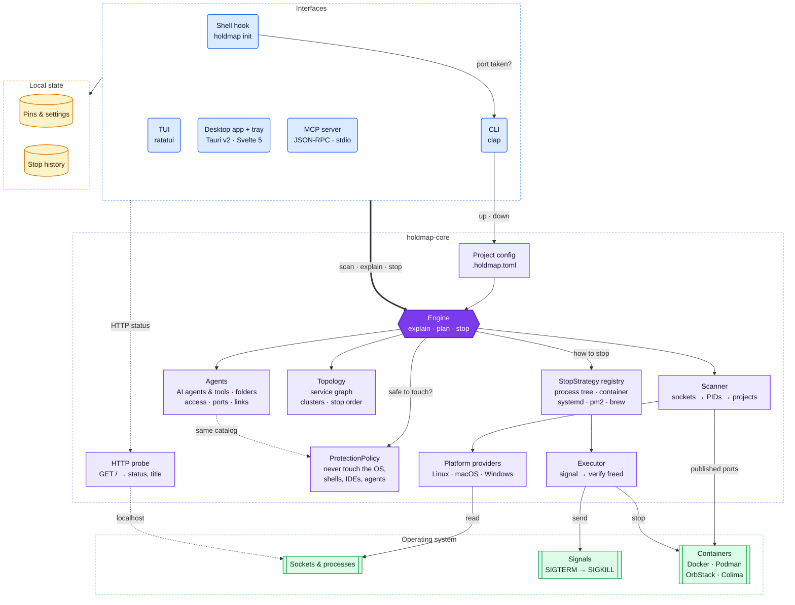

<p align="center">
  
</p>

<h1 align="center">holdmap</h1>

<p align="center">
  <b>See which ports, agents and tools are running — and stop the right thing safely.</b><br/>
  CLI · TUI · desktop and tray app · MCP server, all on one Rust core.
</p>

<p align="center">
  <a href="https://santoshshinde2012.github.io/holdmap/"><b>Website</b></a> ·
  <a href="https://santoshshinde2012.github.io/holdmap/#demo">Live demo</a> ·
  <a href="https://santoshshinde2012.github.io/holdmap/docs/">Guide</a>
</p>

<p align="center">
  <a href="https://github.com/santoshshinde2012/holdmap/actions/workflows/ci.yml"></a>
  <a href="https://github.com/santoshshinde2012/holdmap/releases/latest"></a>
  <a href="#license"></a>
  
</p>

<p align="center">
  <picture>
    <source media="(prefers-color-scheme: dark)" srcset="docs/screenshots/desktop-overview-dark.png" />
    
  </picture>
</p>

`EADDRINUSE: address already in use :::3000`? Most tools hand you a PID and a `kill -9`.
holdmap tells you what's really there — which agent or tool started it — and stops only what
it should.

## Features

- **Who owns the port.** Process, user, command, folder, plus the project, git branch and
  framework (Next.js, Vite, Django, Postgres…) or the Docker / Podman / OrbStack container.
- **Why it's busy, in plain English.** A dev-server tree, a container, a systemd / pm2 / Homebrew
  service, an OS feature like AirPlay Receiver, `TIME_WAIT`, or another user.
- **A safe stop.** Preview the plan, stop the whole dev-server tree gracefully (SIGTERM, then
  SIGKILL), and check the port is free afterwards. System processes and IDEs are protected.
- **What's behind it.** Who is connected right now, the full process tree, uptime, CPU and
  memory (the whole app, helpers included), the HTTP status and title, and what the bind address
  means for your safety.
- **The service graph.** Which local services talk to which, grouped into clusters (Compose,
  Kubernetes, workspaces). Stop a whole stack in dependency order.
- **Your agents, tools and apps.** Claude Code, Codex, Cursor, Copilot, Gemini CLI, Windsurf,
  Aider, Docker Desktop, OrbStack and more: memory, CPU, stoppable ports, parent process, the
  folders each one works in, the ports and apps it started (children grouped as tools & apps),
  the services and hosts it talks to, and access (account, sandbox, approval flags, network
  exposure), each fact marked seen, inferred or unknown. Reveal a folder, open it in your editor,
  or stop only what that agent started. Chats, settings and tokens are never read.
- **Everywhere you work.** A scriptable CLI (`--json`), a TUI, a desktop and tray app, and an MCP
  server for AI coding assistants. macOS, Linux and Windows. No telemetry.

## Install

**macOS and Linux**

```sh
curl -LsSf https://github.com/santoshshinde2012/holdmap/releases/latest/download/holdmap-installer.sh | sh
```

**Windows (PowerShell)**

```powershell
powershell -ExecutionPolicy Bypass -c "irm https://github.com/santoshshinde2012/holdmap/releases/latest/download/holdmap-installer.ps1 | iex"
```

The binary goes to `~/.local/bin` (`%USERPROFILE%\.local\bin` on Windows). If that folder is
already on your `PATH`, `holdmap` works right away. If not, the installer adds it and tells
you: open a new terminal, or run the `source` line it prints.

**Desktop app**

| Platform | Download |
|---|---|
| macOS, Apple silicon | [holdmap_aarch64.dmg][dmg-arm64] |
| macOS, Intel | [holdmap_x64.dmg][dmg-x64] |
| Windows | [.msi][msi] or [setup .exe][nsis] |
| Linux | [.AppImage][appimage], [.deb][deb] or [.rpm][rpm] |

<!-- release-please bumps these (one version per line; the rpm's "-" is %2D so its "-1" release
     suffix isn't read as part of the version). -->
<!-- x-release-please-start-version -->
[dmg-arm64]: https://github.com/santoshshinde2012/holdmap/releases/latest/download/holdmap_0.2.0_aarch64.dmg
[dmg-x64]: https://github.com/santoshshinde2012/holdmap/releases/latest/download/holdmap_0.2.0_x64.dmg
[msi]: https://github.com/santoshshinde2012/holdmap/releases/latest/download/holdmap_0.2.0_x64_en-US.msi
[nsis]: https://github.com/santoshshinde2012/holdmap/releases/latest/download/holdmap_0.2.0_x64-setup.exe
[appimage]: https://github.com/santoshshinde2012/holdmap/releases/latest/download/holdmap_0.2.0_amd64.AppImage
[deb]: https://github.com/santoshshinde2012/holdmap/releases/latest/download/holdmap_0.2.0_amd64.deb
[rpm]: https://github.com/santoshshinde2012/holdmap/releases/latest/download/holdmap-0.2.0%2D1.x86_64.rpm
<!-- x-release-please-end -->

**Homebrew:** coming soon.

**From source** (Rust 1.95+): `cargo install --locked --git https://github.com/santoshshinde2012/holdmap holdmap`

Every release has SHA-256 checksums and build provenance (`gh attestation verify FILE --repo santoshshinde2012/holdmap`).

> **Renamed from portwise.** The binary is now `holdmap`. Config moves from `~/.config/portwise`
> (or the macOS/Windows equivalent) to `holdmap` on first run; `.portwise.toml` and
> `$PORTWISE_HOME` / `$PORTWISE_*` still work.

## Quick start

```sh
holdmap list                 # every listening port, grouped by kind
holdmap agents               # AI agents and tools: folders, ports, access
holdmap agents claude --stop-ports --dry-run   # plan stopping what that agent started
holdmap inspect 3000         # owner, process tree, connections, bind risk and the stop plan
holdmap list --sort memory   # heaviest apps first
holdmap stop 3000 --dry-run  # show exactly what stop would do
holdmap stop 3000            # stop it gracefully, then check the port is free
holdmap run -p 3000 -- npm run dev   # free 3000 safely, then start your server on it
holdmap                      # the interactive TUI (Tab → Agents)
```


**Project stacks.** Describe a project's services once in `.holdmap.toml` (`holdmap init` writes
one from what's running) and start them in dependency order with `holdmap up`:

```toml
name = "shop"

[services.api]
port = 4000
command = "npm run dev"   # runs with PORT set
depends_on = ["db"]

[services.db]
port = 5432               # no command: started elsewhere, up just waits for it
```

`holdmap status` shows the stack and `holdmap down` stops it, dependents first.

## CLI

| Purpose | Commands |
|---|---|
| Look | `holdmap list`, `holdmap inspect`, `holdmap explain`, `holdmap graph`, `holdmap agents`, `holdmap agents AGENT --stop-ports`, `holdmap watch`, `holdmap ssh HOST` (read-only, nothing to install remotely) |
| Act | `holdmap stop`, `holdmap kill`, `holdmap restart`, `holdmap run`, `holdmap open` |
| Ports | `holdmap free-port --near 3000`, `holdmap wait 5432 --timeout 30s` |
| Projects | `holdmap up`, `holdmap down`, `holdmap status`, `holdmap init` |
| Remember | `holdmap pin`, `holdmap unpin`, `holdmap pins`, `holdmap history` |
| Integrate | `holdmap tui`, `holdmap mcp`, `holdmap completions zsh`, `holdmap man` |

Every read command takes `--json`. Exit codes: `0` ok, `1` busy / not found / timed out, `2`
error, `3` blocked by the safety policy, `4` needs elevation. All flags are in the
**[CLI reference](docs/cli.md)**.

**Shell hook.** Add `eval "$(holdmap init zsh)"` to `~/.zshrc` (also `bash`, `fish`, `powershell`).
When a command fails with "port in use", it prints who holds the port and how to free it.

## Desktop app

A tray and menu-bar app with the port list, details, the service graph (`G`), the agents map
(`⇧A`), pins, history with one-click restart, remote hosts over SSH and a command palette (`⌘K` /
`Ctrl+K`). `⌘⌥P` (`Ctrl+Alt+P`) brings it up from any app; press `?` for every shortcut. On the
Agents map, expand a card to reveal a folder, open it in your editor, or stop the unprotected
ports that agent started. From a port’s details pane you can open it in a browser, restart a
dev server, open its folder (`HOLDMAP_EDITOR`, else Cursor, VS Code, Zed…) or Finder, and copy
its URL, a `curl` or the kill command.

**First open.** The app isn't notarised yet, so the OS asks once:

- **macOS:** open it once, then go to **System Settings > Privacy & Security > Open Anyway**
  (macOS 14 and earlier: right-click the app, then **Open**). Or run
  `xattr -dr com.apple.quarantine /Applications/holdmap.app`.
- **Windows:** in "Windows protected your PC", click **More info**, then **Run anyway**.

<details>
<summary>More screenshots</summary>

| Service graph | Stop confirmation |
|---|---|
|  |  |
| **Command palette** | **Settings** |
|  |  |
| **TUI** | **Agents** |
|  |  |

</details>

## MCP server

`holdmap mcp` lets AI coding assistants list ports, explain them, find a free port, wait for a
server, read the service graph, list agents and developer tools (`list_agents`), stop the ports
an agent started (`stop_agent_ports`, dry-run by default), and stop their own dev servers
(never protected processes).
For Claude Desktop or Cursor (`~/.cursor/mcp.json`):

```json
{
  "mcpServers": {
    "holdmap": { "command": "holdmap", "args": ["mcp"] }
  }
}
```

VS Code (`.vscode/mcp.json`) uses `"servers"` with `"type": "stdio"`. If the client can't find
`holdmap`, use the full path, for example `/Users/you/.local/bin/holdmap`.

## Safety model

holdmap stops processes, so one set of rules in `holdmap-core` applies to every surface:

- **Graceful first:** SIGTERM (`taskkill` on Windows), then a force kill after `--timeout` (5 s).
- **The right target:** the dev-server tree root (`npm`, `nodemon`, `uvicorn --reload`…) so nothing
  respawns; containers through their runtime, services through their supervisor.
- **Protected processes:** the OS, shells, terminals, IDEs, AI-assistant hosts and holdmap itself
  are refused unless you pass `--allow-protected` (the MCP server always refuses).
- **No surprises:** a PID-reuse guard, `--dry-run` for every plan, and a check that the port is
  really free afterwards.
- **Private:** passwords and tokens in command lines (`--password=…`, `API_TOKEN=…`,
  `postgres://user:…@`) are hidden in every output, JSON and MCP result included. Agent chats,
  settings and credentials are never read. History and logs are readable only by you. No
  telemetry: holdmap only talks to localhost, to hosts you `ssh` to, and (desktop) GitHub
  Releases for updates.
- **Locked down:** the desktop webview can only listen to events and drag the window; it names
  ports, never commands, paths or URLs. A `.holdmap.toml` that another user owns or anyone can
  write is refused.

## Architecture

One Rust core makes every decision about who owns a port, whether it is safe to touch and how to
stop it; the CLI, TUI, desktop app and MCP server only render and confirm what it returns.



Modules, traits and data flow: [docs/architecture.md](docs/architecture.md).

## Troubleshooting

- **`command not found: holdmap`** right after installing: open a new terminal, or run
  `source ~/.config/holdmap/env.sh`.
- **Upgrading from v0.1.0:** remove the old copy with `rm ~/.cargo/bin/holdmap`.
  `command -v holdmap` shows which one runs.
- **`Permission denied` on a shell rc file:** an old `sudo` left it owned by root. Run
  `sudo chown "$USER" ~/.bash_profile` and install again. Never run the installer with `sudo`.
- **Other users' ports are hidden:** run with `sudo` (an elevated terminal on Windows).
- **Slow or stale list:** `HOLDMAP_TRACE=scan holdmap list` prints how long each part of a scan
  took (sockets, processes, containers).
- **Uninstall:** `rm ~/.local/bin/holdmap`, remove the `env.sh` line the installer added to your
  shell rc files, and delete the app. Settings and history live in `~/.config/holdmap` (macOS:
  `~/Library/Application Support/holdmap`, Windows: `%APPDATA%\holdmap`).

## Learn more

- [Website and guide](https://santoshshinde2012.github.io/holdmap/): the live demo and short how-tos.
- [Agents, tools and apps](https://santoshshinde2012.github.io/holdmap/docs/agents/): folders, access and stopping what an agent started.
- [CLI reference](docs/cli.md): every command and flag.
- [Architecture](docs/architecture.md): how the core, CLI, TUI, desktop app and MCP server fit together.
- [Changelog](CHANGELOG.md) and [security policy](SECURITY.md).

## Contributing

Contributions are welcome. [CONTRIBUTING.md](CONTRIBUTING.md) covers setup, checks and
conventions, including building the desktop app.

## License

Dual-licensed under [Apache-2.0](LICENSE-APACHE) or [MIT](LICENSE-MIT), at your option. Unless
you state otherwise, any contribution you submit is dual-licensed the same way. The desktop app
bundles Inter and JetBrains Mono under the SIL Open Font License 1.1.
