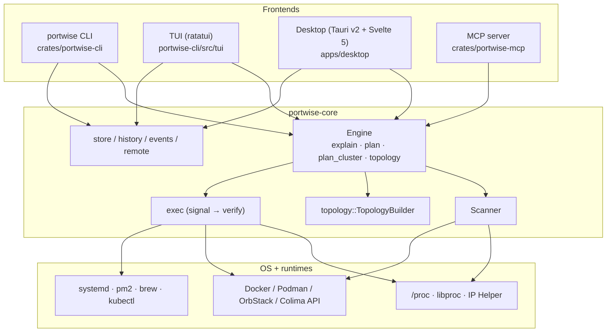
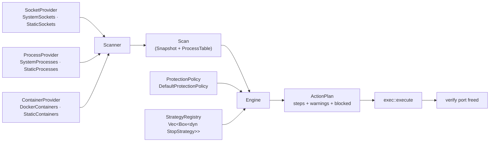
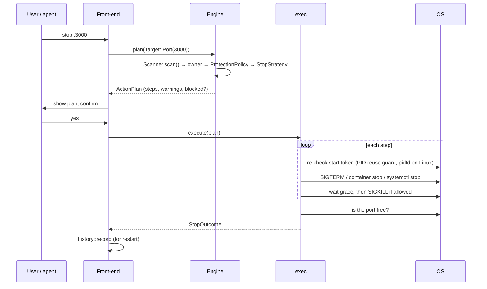
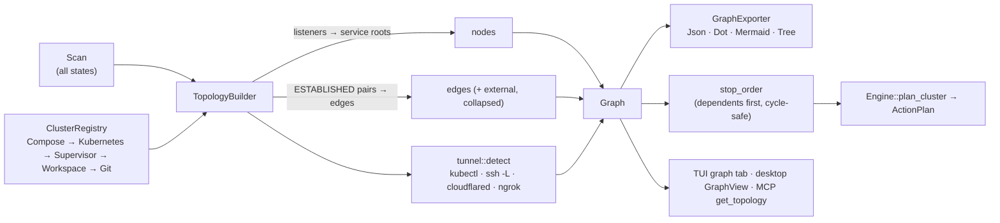
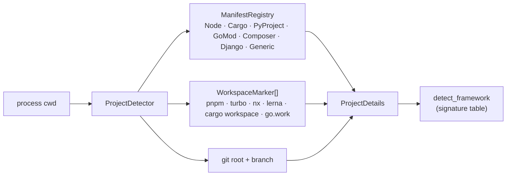
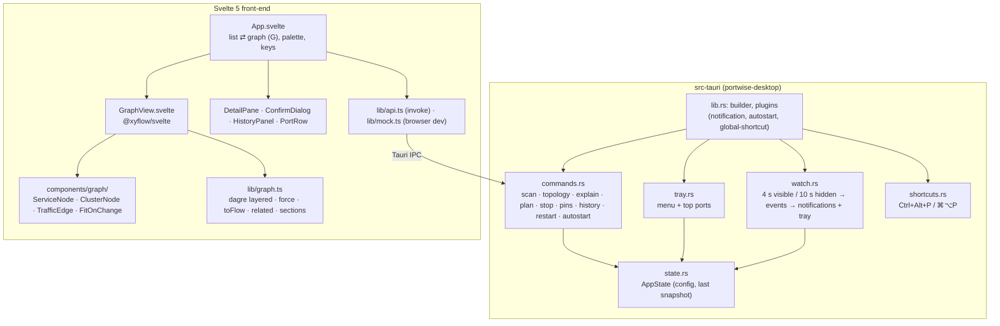

# portwise architecture

portwise is one Rust library (`portwise-core`) with four thin front-ends. Every decision about
*who owns a port, whether it's safe to touch, and how to stop it* lives in the core; the
front-ends only render and confirm what it returns.

## 1. Layers

## 2. Scan → plan → execute

The core is built from small traits so each piece can be swapped (real OS, recorded fixture, or a
fake in a test) without touching the others (dependency inversion).

`StrategyRegistry` asks each `StopStrategy` in priority order whether it applies to an owner and
takes the first that does:

| Strategy | Handles |
|---|---|
| `container` | docker-proxy / published container ports → stop the container |
| `hidden` | socket whose owner we can't see → "needs elevation" |
| `os_service` | AirPlay, HTTP.sys, wslrelay … → explain, never kill |
| `protected` | own tree, IDE/agent hosts, interactive shells, PID 1 … → blocked |
| `other_user` | another user's process → needs elevation |
| `systemd` | unit or `.socket` activation → `systemctl stop` |
| `pm2` | pm2-managed app → `pm2 stop` |
| `brew` | `brew services` → `brew services stop` |
| `process_tree` | fallback: launcher tree (npm → node → esbuild …) bottom-up SIGTERM → SIGKILL |

Adding a supervisor means adding one `impl StopStrategy` and registering it. `Engine`, the CLI
and the UIs don't change (open/closed).

### Stop sequence

## 3. Topology / mesh

* **Nodes** are services, not PIDs: a listener is folded up to its service root (the launcher
  tree), so `npm run dev → node → esbuild` is one node with all its ports.
* **Edges** come from ESTABLISHED sockets where both ends are local; traffic weight is the
  connection count. Remote peers collapse into one `external` node per host.
* **Clusters** come from the first `ClusterDetector` that claims a node (compose project label,
  k8s namespace of a port-forward, pm2/turbo/concurrently/nx parent, workspace root, git repo).
* **Stop order**: callers before callees (`web → api → db`), so nothing reconnects to a
  dependency mid-shutdown. The order is deterministic, which proptest checks.
  Dependents outside the cluster become warnings in the plan.

## 4. Project detection

## 5. Desktop app

`commands.rs` only converts arguments and calls the core. All behaviour lives in `portwise-core`,
and all view logic (layout, filtering, ordering) lives in pure TypeScript modules that vitest
covers.

## 6. Graph library choice

**Svelte Flow (`@xyflow/svelte` 1.x) + `@dagrejs/dagre`**, with our own small deterministic force
simulation for the "organic" layout.

| Need | Svelte Flow | Cytoscape.js | d3-force + hand-rolled SVG |
|---|---|---|---|
| Svelte 5 native | ✅ | wrapper | manual |
| Nodes are real DOM (reuse `FrameworkIcon`, CSS tokens, focus rings) | ✅ | ❌ canvas | ✅ |
| Group/parent nodes for cluster hulls | ✅ | ✅ compound | manual |
| Custom animated edges (direction + traffic dots via `animateMotion`) | ✅ | limited | ✅ |
| MiniMap, Controls, Background, fit/zoom | built-in | plugins | manual |
| Dark mode (`colorMode`) | ✅ | manual | manual |
| Bundle cost | moderate | heavier | small, but most work is ours |

dagre gives a stable layered (left-to-right, callers → callees) layout that matches the stop
order. Isolated services are placed on a grid instead of one long row. The force layout is
seeded and deterministic so the graph doesn't move between refreshes. That is why there's no
d3 dependency.

## 7. SOLID notes

* **S**: `scan` gathers, `engine` decides, `exec` acts, `topology` relates, `store` persists.
  The desktop backend is split by concern (`commands`/`state`/`tray`/`watch`/`shortcuts`).
* **O**: four open registries: `StrategyRegistry`, `ClusterRegistry`, `ManifestRegistry` and
  `WorkspaceMarker`s, plus the `exporter(name)` factory. New behaviour is a new impl.
* **L**: every `StopStrategy` returns the same `Resolution` contract. Every exporter takes a
  `&Graph` and returns a `String`.
* **I**: the providers are three narrow traits rather than one "system" trait. `ProtectionPolicy`
  is a single method set.
* **D**: `Engine` and `Scanner` take trait objects. Tests inject `Static*` providers and fixture
  tables (see `engine` tests, `topology/tests.rs`, `benches/scan.rs`). Only `Engine::system()`
  wires the real OS.
