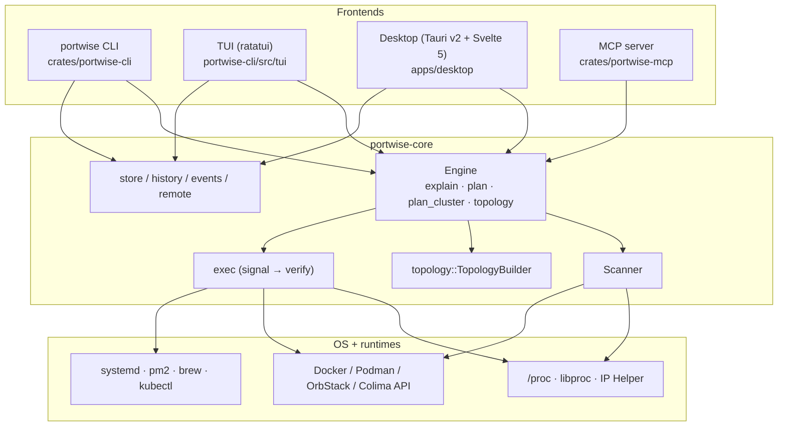
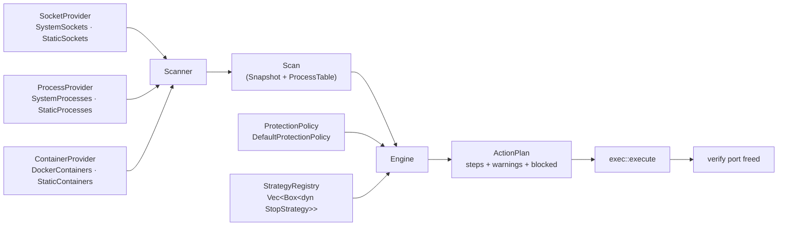
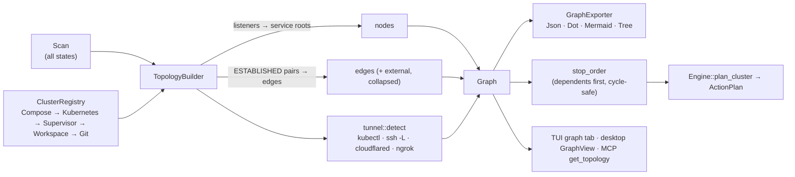
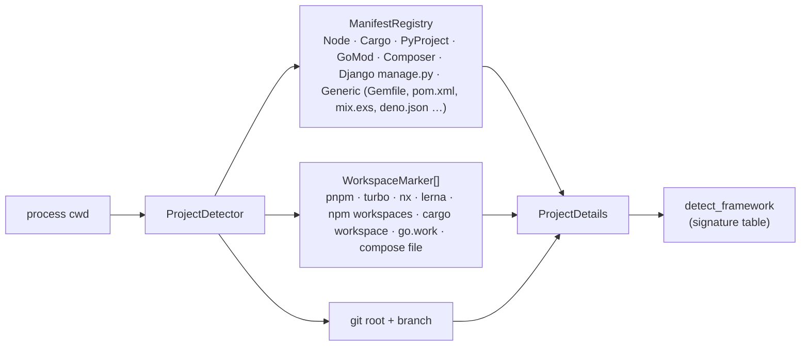
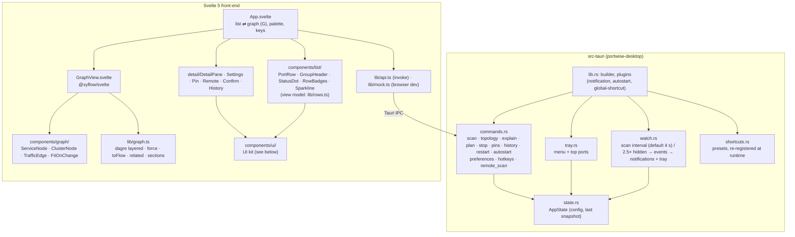

# portwise architecture

portwise is one Rust library (`portwise-core`) with four thin front-ends. Every decision about
*who owns a port, whether it's safe to touch, and how to stop it* lives in the core; the
front-ends only render and confirm what it returns.

## 1. Layers

## 2. Scan → plan → execute

The core is built from small traits so each piece can be swapped (real OS, recorded fixture, or a
fake in a test) without touching the others (dependency inversion).

`StrategyRegistry` asks each `StopStrategy` in priority order whether it applies to an owner and
takes the first that does:

| Strategy | Handles |
|---|---|
| `container` | docker-proxy / published container ports → stop the container |
| `hidden` | socket whose owner we can't see → "needs elevation" |
| `os_service` | AirPlay, HTTP.sys, wslrelay … → explain, never kill |
| `systemd` | unit or `.socket` activation → `systemctl stop` |
| `pm2` | pm2-managed app → `pm2 stop` |
| `brew` | `brew services` → `brew services stop` |
| `protected` | own tree, IDE/AI-assistant hosts, interactive shells, PID 1 … → blocked |
| `other_user` | another user's process → needs elevation |
| `process_tree` | fallback: launcher tree (npm → node → esbuild …) bottom-up SIGTERM → SIGKILL |

Supervisors come before `protected` on purpose: a pm2 app or a systemd unit must be stopped
through its supervisor even though its process would also match a later rule. The table is the
order of `StrategyRegistry::default()` in `engine/strategies/mod.rs`.

Adding a supervisor means adding one `impl StopStrategy` and registering it. `Engine`, the CLI
and the UIs don't change (open/closed).

### Stop sequence

## 3. Topology / mesh

* **Nodes** are services, not PIDs: a listener is folded up to its service root (the launcher
  tree), so `npm run dev → node → esbuild` is one node with all its ports.
* **Edges** come from ESTABLISHED sockets where both ends are local; traffic weight is the
  connection count. Remote peers collapse into one `external` node per host.
* **Clusters** come from the first `ClusterDetector` that claims a node (compose project label,
  k8s namespace of a port-forward, pm2/turbo/concurrently/nx parent, workspace root, git repo).
* **Stop order**: callers before callees (`web → api → db`), so nothing reconnects to a
  dependency mid-shutdown. The order is deterministic, which proptest checks.
  Dependents outside the cluster become warnings in the plan.

## 4. Project detection

## 5. Desktop app

`commands.rs` only converts arguments and calls the core. All behaviour lives in `portwise-core`,
and all view logic (layout, filtering, ordering) lives in pure TypeScript modules that vitest
covers.

### Desktop UI

- **UI kit.** `apps/desktop/src/components/ui/` is the only place that styles controls (fields,
  selects, switches, buttons, dialogs, tabs…); feature components compose it. Open the app with
  `#ui-gallery` to see every control in both themes.
- **Pure view logic.** `lib/rows.ts` (badges, status, sparklines), `lib/detail.ts` (details pane)
  and `lib/settings.ts` (the Settings contract) are pure and unit-tested, so components depend on
  interfaces rather than on `api.ts`.
- **Accessibility.** The list is a `role=listbox` with `aria-activedescendant`, dialogs trap and
  restore focus, and `src/contrast.test.ts` keeps text tokens at WCAG AA in both themes.
- **Typography.** Inter Variable for UI text and JetBrains Mono Variable for code, PIDs and paths,
  bundled locally (SIL OFL 1.1). One scale (11–32 px, base 13 px, weights 400/500/600) exposed as
  semantic tokens in `app.css`; `src/typography.test.ts` rejects raw values. The TUI and CLI map the
  same roles onto bold and colour.

## 6. Graph library

The graph view uses **Svelte Flow (`@xyflow/svelte`) and `@dagrejs/dagre`**. Nodes are real DOM
(so they reuse the icons, tokens and focus rings), group nodes draw the cluster hulls, and the
minimap and zoom controls are built in. dagre gives a stable left-to-right layout that matches the
stop order; the alternative "organic" layout is a small seeded force simulation, so the graph
doesn't move between refreshes.

## 7. Design notes

- `scan` gathers, `engine` decides, `exec` acts, `topology` relates and `store` persists. The
  desktop backend is split into `commands`, `state`, `tray`, `watch` and `shortcuts`.
- Behaviour is extended through registries: `StrategyRegistry`, `ClusterRegistry`,
  `ManifestRegistry`, `WorkspaceMarker`s and the `exporter(name)` factory.
- `Engine` and `Scanner` take trait objects, so tests inject static providers and fixture tables.
  Only `Scanner::system()` (used by `Engine::new`) touches the real OS.
- `docs/cli.md`, the man pages and the shell completions are all generated from the clap
  definitions; `cargo test` fails when `docs/cli.md` is stale.
