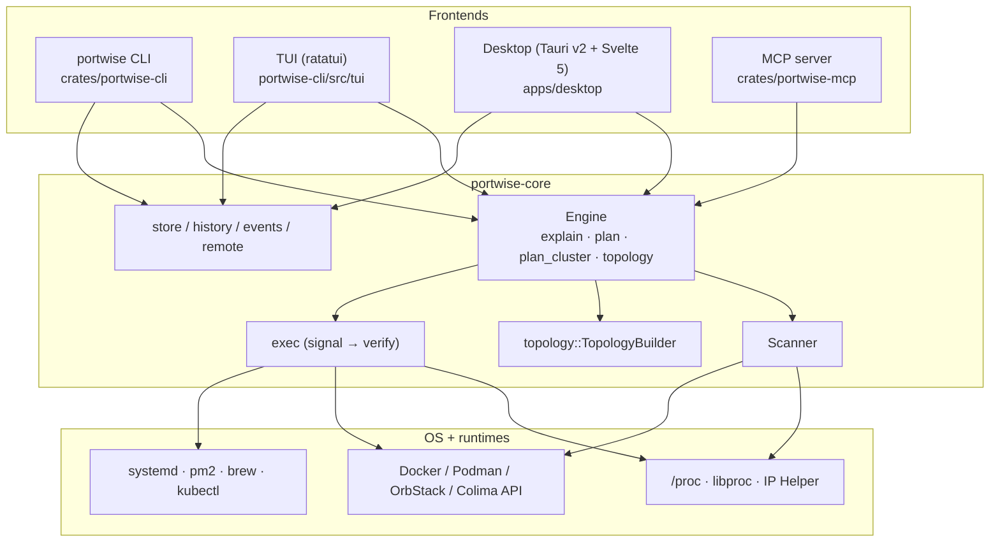
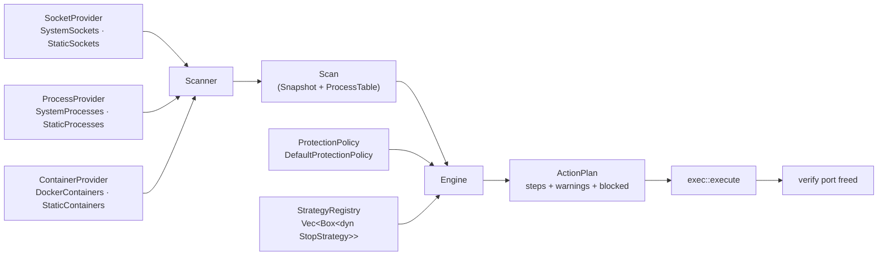
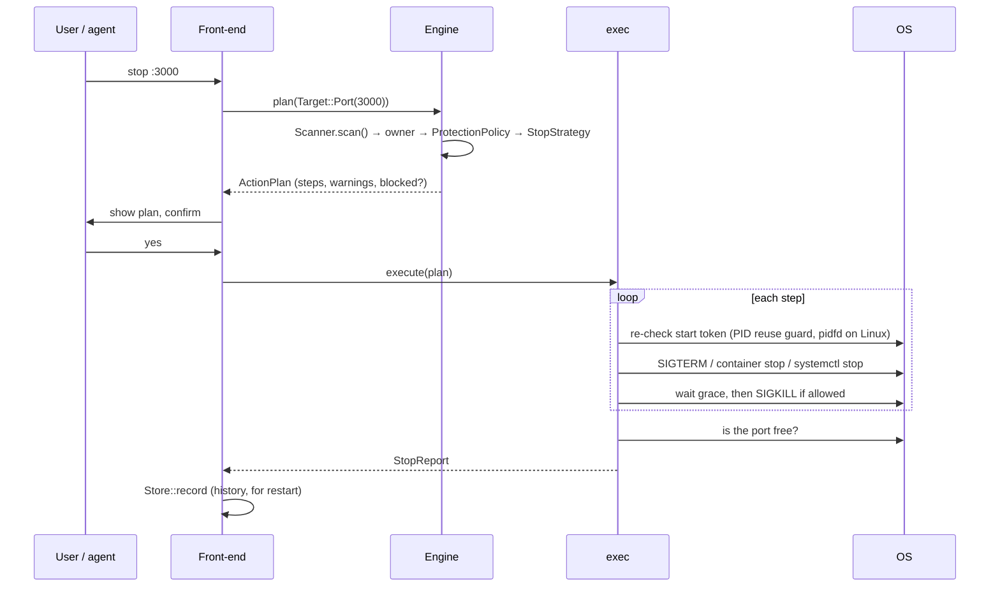
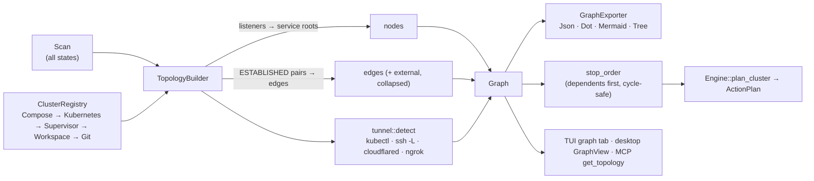
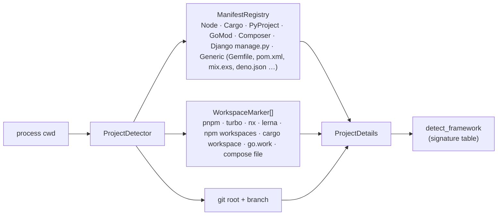
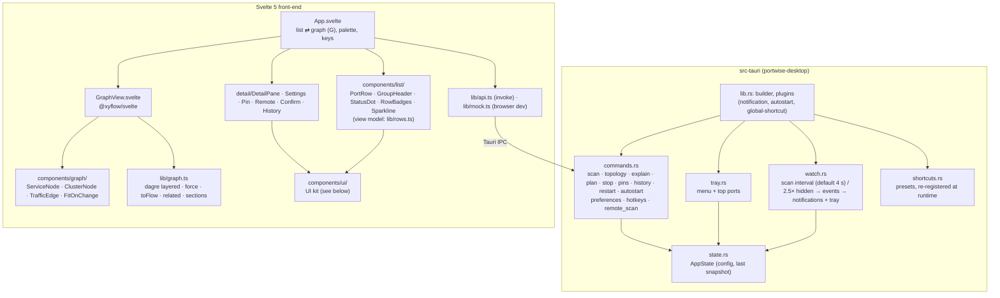

# portwise architecture

portwise is one Rust library (`portwise-core`) with four thin front-ends. Every decision about
*who owns a port, whether it's safe to touch, and how to stop it* lives in the core; the
front-ends only render and confirm what it returns.

## 1. Layers

## 2. Scan → plan → execute

The core is built from small traits so each piece can be swapped (real OS, recorded fixture, or a
fake in a test) without touching the others (dependency inversion).

`StrategyRegistry` asks each `StopStrategy` in priority order whether it applies to an owner and
takes the first that does:

| Strategy | Handles |
|---|---|
| `container` | docker-proxy / published container ports → stop the container |
| `hidden` | socket whose owner we can't see → "needs elevation" |
| `os_service` | AirPlay, HTTP.sys, wslrelay … → explain, never kill |
| `systemd` | unit or `.socket` activation → `systemctl stop` |
| `pm2` | pm2-managed app → `pm2 stop` |
| `brew` | `brew services` → `brew services stop` |
| `protected` | own tree, IDE/agent hosts, interactive shells, PID 1 … → blocked |
| `other_user` | another user's process → needs elevation |
| `process_tree` | fallback: launcher tree (npm → node → esbuild …) bottom-up SIGTERM → SIGKILL |

Supervisors come before `protected` on purpose: a pm2 app or a systemd unit must be stopped
through its supervisor even though its process would also match a later rule. The table is the
order of `StrategyRegistry::default()` in `engine/strategies/mod.rs`.

Adding a supervisor means adding one `impl StopStrategy` and registering it. `Engine`, the CLI
and the UIs don't change (open/closed).

### Stop sequence

## 3. Topology / mesh

* **Nodes** are services, not PIDs: a listener is folded up to its service root (the launcher
  tree), so `npm run dev → node → esbuild` is one node with all its ports.
* **Edges** come from ESTABLISHED sockets where both ends are local; traffic weight is the
  connection count. Remote peers collapse into one `external` node per host.
* **Clusters** come from the first `ClusterDetector` that claims a node (compose project label,
  k8s namespace of a port-forward, pm2/turbo/concurrently/nx parent, workspace root, git repo).
* **Stop order**: callers before callees (`web → api → db`), so nothing reconnects to a
  dependency mid-shutdown. The order is deterministic, which proptest checks.
  Dependents outside the cluster become warnings in the plan.

## 4. Project detection

## 5. Desktop app

`commands.rs` only converts arguments and calls the core. All behaviour lives in `portwise-core`,
and all view logic (layout, filtering, ordering) lives in pure TypeScript modules that vitest
covers.

### Desktop UI kit

`apps/desktop/src/components/ui/` is the only place that styles controls. Feature components
compose it and never restyle inputs themselves. Open the app with `#ui-gallery` to see every
control in both themes (`src/dev/Gallery.svelte`).

| Component | Notes |
|---|---|
| `Field` | label, hint, error (`role=alert`), required/optional, counter; wires `aria-describedby` / `aria-invalid` |
| `TextField` | default / filled, leading icon, clear button (Esc clears first), kbd hint, mono, trailing slot |
| `NumberInput` | spinbutton: ↑/↓ (Shift ×10), Home/End, steppers, unit, never commits an invalid value |
| `Select` | APG select-only combobox: popover listbox, type-ahead, descriptions, prefix label |
| `Switch` · `Checkbox` · `SegmentedControl` · `FilterChip` · `Tabs` | roving focus via `lib/roving.ts` |
| `Button` · `IconButton` · `Kbd` | variants primary / secondary / ghost / soft / danger / danger-outline; xs 24 · sm 28 · md 32 · lg 36; loading, `tip` |
| `Dialog` | center / right sheet / top; focus trap + restore (`lib/focus.ts`), Esc + backdrop close, alertdialog |
| `ScrollArea` · `CopyValue` · `Callout` · `Splitter` · `SettingRow` · `SettingsGroup` · `RichText` | scroll-edge shadows, truncate + tooltip + copy, resizable pane |

### Port list

The list is a `role=listbox` that keeps focus and points at the selected row with
`aria-activedescendant`. Each section is a `role=group` named by its sticky `GroupHeader`.
↑/↓/J/K, Home/End and PageUp/PageDown move the selection, and ←/→ collapse or expand the
selected row's section. Collapsed sections are saved in `pw.collapsed` and skipped by the
keyboard. Each row is an `option` with `aria-selected` and `aria-posinset`/`aria-setsize`.

Every row uses the same fixed grid, so columns line up down the whole list:

| status | port | tile + name · framework · ★ | meta (process · PID · branch) | badges (≤ 2, "+N") | CPU sparkline + memory | age |
|---|---|---|---|---|---|---|
| 8 px | 48 px | `minmax(160px, 1.25fr)` | `minmax(0, 1fr)` | 160 px, right-aligned | 84 px | 52 px |

- **Narrow widths:** columns drop with container queries on the list itself (`container: portlist`),
  so they follow the pane width rather than the window. Age goes at ≤ 900 px, usage at ≤ 740,
  meta (and all but the top badge) at ≤ 600, and badges and the framework name at ≤ 420.
- **Actions:** Open, Pin and Stop are absolutely positioned over the trailing data columns,
  which fade out on hover or selection. Nothing reflows, and no width is kept empty for them.
- **Density:** comfortable rows are 44 px and compact rows are 36 px. Change it in Settings → Appearance
  or from the palette. The setting is stored in `pw.density`.
- **States:** hover is a faint tint. Selected adds an accent tint and a 2.5 px accent bar on the left.
  Keyboard focus adds a 2 px inset ring. Hairline separators are hidden next to tinted rows,
  and there is no zebra striping.
- **View model:** `lib/rows.ts` is pure and unit-tested. It holds the badge priority (exposed >
  protected > container > owner > links), the "+N" split, status, meta, labels, the rolling
  `UsageHistory` (24 CPU samples per entry) and the sparkline geometry.

### Typography

**Typefaces.** The app bundles its own fonts in `apps/desktop/src/assets/fonts/`
(`inter-variable.woff2`, `jetbrains-mono-variable.woff2`, with their licences). They are
loaded from `fonts.css` with `font-display: swap` and fall back to the system stack while
loading. Nothing is fetched from a network.

- **Inter Variable** (v4.1, `opsz` + `wght` axes) for all UI text. It was drawn for screens at
  11–14 px: tall x-height, open apertures, and real tabular figures. The optical-size axis
  switches to the Display cut automatically for the 24 px port hero. Features: `cv11`
  (single-storey a), `ss01` (open digits) and `calt`. `tnum` is applied only where numbers must
  line up (ports, counts, sizes, durations) through `font-variant-numeric`.
- **JetBrains Mono Variable** (v2.304) for PIDs, paths, commands and code. Its 0/O and 1/l/I
  are unambiguous, it stays legible at 11–12 px, and its x-height matches Inter's at one step
  smaller. Ligatures are turned off.
- Both are SIL OFL 1.1. They are subset to Latin, Latin Extended, punctuation and the UI
  symbols we draw (⌘ ⌥ ⇧ ⌫ ↵, arrows, ✓, box drawing), about 290 KB together.

**Scale.** 11 · 12 · 13 · 14 · 16 · 20 · 24 · 32 px, base 13 px, weights 400 / 500 / 600 only.
Components use semantic roles, never the raw scale:

| Role | Size / line height | Weight | Tracking | Used for |
|---|---|---|---|---|
| `display` | 24 / 30 | 600 | −2.1% | port hero |
| `title` | 16 / 22 | 600 | −1.1% | dialog titles, row port numbers, empty states |
| `heading` | 14 / 20 | 600 | −0.6% | settings groups, stat values, lead paragraphs (at 400) |
| `body` | 13 / 20 | 400 | −0.25% | default text, controls, row names (600) |
| `body-sm` | 12 / 17 | 400 | 0 | secondary lines, hints, small buttons |
| `caption` | 11 / 15 | 400 | +0.5% | counts, edge labels, meta |
| `label` | 11 / 15 | 500 | +6% | uppercase section labels |
| `mono` | 12 / 18 | 400 | 0 | commands, paths, code |
| `mono-sm` | 11 / 16 | 400 | 0 | PIDs, branches, inline meta |

The weights follow one rule. 600 is for titles, headings, port numbers and row names. 500 is
for controls, labels, tabs, chips and badges. Everything else is 400. `body` sets antialiased
smoothing, `text-rendering: optimizeLegibility`, `font-synthesis: none` and automatic optical
sizing. `src/typography.test.ts` fails the build on any raw `font-size`, `font-weight`,
`line-height`, `letter-spacing` or `font-family` outside the `:root` tokens. The one exempt
case is the framework monogram, which scales with its tile and is marked `type-exempt`. The
`#ui-gallery` page renders the full specimen.

**Terminal surfaces.** A terminal only has weight and colour, so the TUI (`tui/theme.rs`) and
the CLI (`style.rs`) map the same roles onto them. Headings are bold. Ports are accent and
bold in the list table, the graph tree and the TUI alike. Labels and table headers are muted
and bold. Captions are muted. Keys are accent and bold.

Tooltips are one shared element driven by the `use:tooltip` action (`lib/tooltip.ts`); native
`title` is not used. Tokens live in `app.css` (`--h-*`, `--r-*`, `--input-*`, `--focus-ring`,
`--accent-fg`, `--danger-fg`), and `src/contrast.test.ts` checks the text tokens against WCAG AA
in both themes. The details pane's logic (`lib/detail.ts`: tabs, footer state, CLI equivalents)
and the Settings contract (`lib/settings.ts`: `SettingsModel` in, `SettingsActions` out) are
pure, so the dialogs depend on interfaces rather than on `api.ts`.

## 6. Graph library choice

**Svelte Flow (`@xyflow/svelte` 1.x) + `@dagrejs/dagre`**, with our own small deterministic force
simulation for the "organic" layout.

| Need | Svelte Flow | Cytoscape.js | d3-force + hand-rolled SVG |
|---|---|---|---|
| Svelte 5 native | ✅ | wrapper | manual |
| Nodes are real DOM (reuse `FrameworkIcon`, CSS tokens, focus rings) | ✅ | ❌ canvas | ✅ |
| Group/parent nodes for cluster hulls | ✅ | ✅ compound | manual |
| Custom animated edges (direction + traffic dots via `animateMotion`) | ✅ | limited | ✅ |
| MiniMap, Controls, Background, fit/zoom | built-in | plugins | manual |
| Dark mode (`colorMode`) | ✅ | manual | manual |
| Bundle cost | moderate | heavier | small, but most work is ours |

dagre gives a stable layered (left-to-right, callers → callees) layout that matches the stop
order. Isolated services are placed on a grid instead of one long row. The force layout is
seeded and deterministic so the graph doesn't move between refreshes. That is why there's no
d3 dependency.

## 7. SOLID notes

* **S**: `scan` gathers, `engine` decides, `exec` acts, `topology` relates, `store` persists.
  The desktop backend is split by concern (`commands`/`state`/`tray`/`watch`/`shortcuts`).
* **O**: four open registries: `StrategyRegistry`, `ClusterRegistry`, `ManifestRegistry` and
  `WorkspaceMarker`s, plus the `exporter(name)` factory. New behaviour is a new impl.
* **L**: every `StopStrategy` returns the same `Resolution` contract. Every exporter takes a
  `&Graph` and returns a `String`.
* **I**: the providers are three narrow traits rather than one "system" trait. `ProtectionPolicy`
  is a single method set.
* **D**: `Engine` and `Scanner` take trait objects. Tests inject `Static*` providers and fixture
  tables (see `engine` tests, `topology/tests.rs`, `benches/scan.rs`). Only `Scanner::system()`
  (used by `Engine::new`) wires the real OS; `Engine::from_scan` takes any `Scan`.

## 8. Documentation and checks

The docs are tested like code, so they can't drift from it:

* `docs/cli.md` is generated from the clap definitions (`crates/portwise-cli/src/cli_docs.rs`);
  `cargo test` fails when it is stale, and `PORTWISE_BLESS=1` regenerates it. The same
  definitions produce the man pages (`clap_mangen`) and shell completions (`clap_complete`).
* `crates/portwise-cli/tests/repo_conventions.rs` checks every Markdown link, image and anchor,
  flags screenshots no document uses, and enforces the file-naming rules in `CONTRIBUTING.md`.
* `portwise-core` and `portwise-mcp` deny missing docs (`#![warn(missing_docs)]` plus
  `RUSTDOCFLAGS="-D warnings"` in CI).
