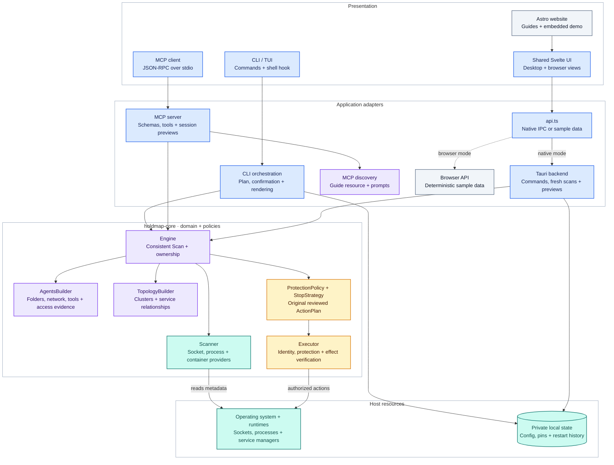
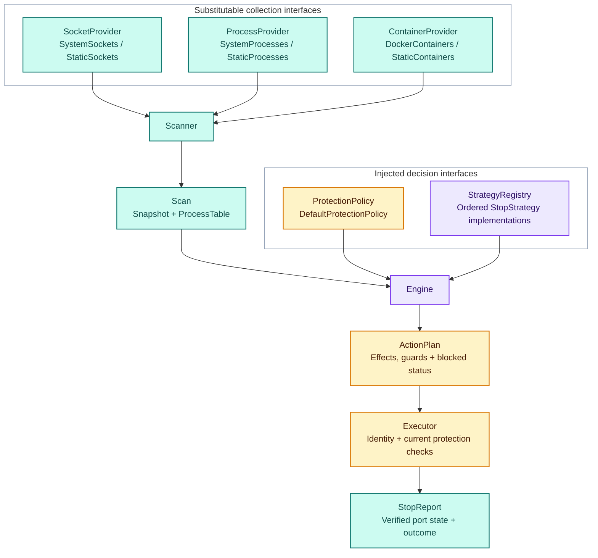
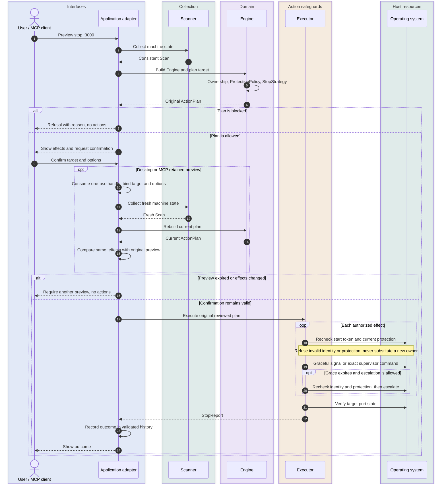
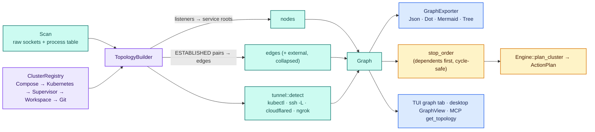
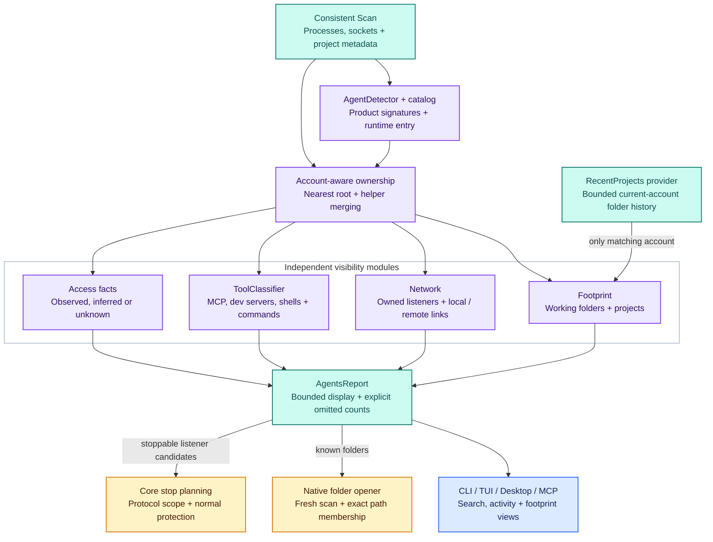
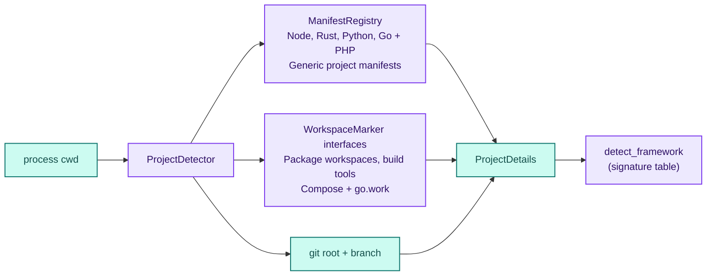
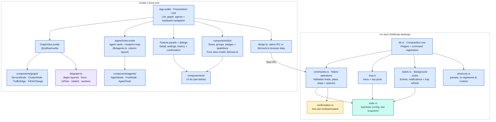

# holdmap architecture

holdmap shares one Rust library (`holdmap-core`) across its CLI, TUI, desktop app and MCP
server. The core determines ownership, protection and stop plans. Adapters validate requests,
coordinate collection and confirmation, and present the returned types.

This guide describes current source. Child-tool metadata, MCP discovery, cache and security improvements
are [Unreleased](../CHANGELOG.md#unreleased); the downloadable 0.3.0 release predates those
additions.

## 1. Layers

All component diagrams use the same palette: blue for interfaces and adapters, violet for
domain logic, amber for action safeguards, teal for collection and state, and slate for
browser-only website components. Named boundaries and arrow labels make the meaning readable
without relying on color.

The website builds the same desktop UI for browser mode; `api.ts` selects native IPC or sample
data. The native cache belongs to the desktop adapter. Core engines operate on a consistent
`Scan`, which other adapters collect directly. Local configuration, pins and stop history use
`store`; project stacks and bounded HTTP probes have separate modules.

The Linux GTK3 binding family currently requires GLib 0.18. A narrow
[local source backport](../vendor/README.md) preserves that API while fixing upstream iterator
unsoundness and boxed-inline slice allocation, plus a documented local zero-initialization
fix for `Value` copies. It is excluded from the first-party workspace.
Whole-snapshot hash verification, locked Cargo resolution and optimized Linux regressions
check the override; registry advisory scans alone do not inspect local path packages. The
original version and license remain unchanged.

## 2. Scan → plan → execute

The core is built from small traits so each piece can be swapped (real OS, recorded fixture, or a
fake in a test) without touching the others (dependency inversion).

`StrategyRegistry` asks each `StopStrategy` in priority order whether it applies to an owner and
takes the first that does:

| Strategy | Handles |
|---|---|
| `container` | docker-proxy / published container ports → stop the container |
| `hidden` | socket whose owner we can't see → "needs elevation" |
| `os_service` | AirPlay, HTTP.sys, wslrelay … → explain, never kill |
| `systemd` | unit or `.socket` activation → `systemctl stop` |
| `pm2` | pm2-managed app → `pm2 stop` |
| `brew` | `brew services` → `brew services stop` |
| `protected` | own tree, IDE/AI-assistant hosts, interactive shells, PID 1 … → blocked |
| `other_user` | another user's process → needs elevation |
| `process_tree` | fallback: launcher tree (npm → node → esbuild …) bottom-up SIGTERM → SIGKILL |

Supervisors come before `protected` on purpose: a pm2 app or a systemd unit must be stopped
through its supervisor even though its process would also match a later rule. The table is the
order of `StrategyRegistry::default()` in `engine/strategies/mod.rs`.

Adding a supervisor means adding one `impl StopStrategy` and registering it. `Engine`, the CLI
and the UIs don't change (open/closed).

### Stop sequence

Planning does not signal processes. Desktop and MCP preview handles retain the original plan.
An executing request must match its preview's target/options and a fresh plan's semantic effects;
changed identities or actions require another preview. `ActionPlan::same_effects` compares effect
identity and authorization while ignoring display text and resource metrics. Desktop agent bulk
confirmation shows every queued plan; MCP validates the entire captured bulk before acting.
The executor receives the original plan rather than substituting fresh effects.

`ActionPlan::allow_protected` carries an explicit soft-protection override, defaulting to false
when deserializing older plans. Core execution rechecks process start tokens and hard/soft
protection before the initial signal and escalation. Ordinary supervisor commands carry an
optional `RunCommand.guard` to pin their owner; named systemd socket units use logical unit
identity and check the associated service's protection instead of signalling its PID 1 manager.
MCP exposes no protected-owner override. Its adapter independently checks current-account
ownership for every pinned process effect, because supervisor strategy priority and a low-risk
label do not establish account ownership. Unknown or foreign owners and unpinned systemd socket
plans are refused. Agent bulk targets retain each matched listener's TCP/UDP protocol. Execution
verifies target ports afterwards; blocked
plans cannot execute. OS identity binding still has platform limits described in
[SECURITY.md](../SECURITY.md).

## 3. Topology / mesh

* **Nodes** are services, not PIDs: a listener is folded up to its service root (the launcher
  tree), so `npm run dev → node → esbuild` is one node with all its ports.
* **Edges** come from ESTABLISHED sockets where both ends are local; traffic weight is the
  connection count. Remote peers collapse into one `external` node per host.
* **Clusters** come from the first `ClusterDetector` that claims a node (compose project label,
  k8s namespace of a port-forward, pm2/turbo/concurrently/nx parent, workspace root, git repo).
* **Stop order**: callers before callees (`web → api → db`), so nothing reconnects to a
  dependency mid-shutdown. The order is deterministic, which proptest checks.
  Dependents outside the cluster become warnings in the plan.

### Agents

`agents::AgentsBuilder` turns the same `Scan` into an `AgentsReport`:

* **Who.** `agents::catalog` names each agent product: bundle, process name, install path or
  entry script. Kinds cover terminal agents, AI editors, desktop apps, extensions, hosts and
  developer tools (Docker Desktop, OrbStack…). Parsed executable and runtime signatures avoid
  treating a product name in an ordinary argument as an agent. Editors, desktop apps and tools
  fold their helpers into one root; a terminal agent started inside one remains its own agent,
  linked by a parent edge. `ProtectionPolicy` shares the catalog for session recognition. Tool
  products retain their existing OS-service policy rather than acquiring AI-session protection.
* **Where.** Folders are the members' working directories, with project details from the scan,
  plus recent projects from a `RecentProjects` source. It reads only directory names under
  `~/.claude/projects` and the window folder URIs in the editors' `storage.json`. It never opens
  chats, settings or tokens.
* **Reach.** Listening ports held by the agent or its children, and ESTABLISHED links grouped by
  local service or remote `ip:port` (no DNS). Local listener attribution matches both the address
  and port; a listener bound to a specific interface can be reachable beyond loopback. An IPv6
  wildcard can be a fallback for a possible dual-stack IPv4 listener; `IPV6_V6ONLY` is not
  observed, so that fallback is an attribution hint.
* **Tools.** Child processes are classified separately as likely MCP servers, development
  servers, shells or commands. MCP candidates are visible even without a listening socket.
  These are process-derived hints, with evidence labels; running a server does not establish
  which tools an agent called.
* **Access.** Each fact (account, sandbox, approvals, network, privacy) carries `observed`,
  `inferred` or `unknown`. Folders inside macOS privacy-protected areas are listed but not read.

Agent detection, process ownership, network attribution and tool classification have separate
modules. `AgentsBuilder` composes an `AgentDetector`, a `ToolClassifier` and a `RecentProjects`
source; the defaults use the shared product catalog and observed process metadata. Its project
cache can also be supplied explicitly, so tests use isolated caches while production shares the
normal cache. Tests can replace these boundaries without scanning the host or reading real
agent state.

| Agent module | Responsibility |
|---|---|
| `builder.rs` | Compose dependencies, collect a report and apply display limits |
| `catalog.rs` | Product signatures, conservative runtime parsing and `AgentDetector` |
| `ownership.rs` | Assign descendants to their nearest root and merge matching helper accounts |
| `footprint.rs` | Working folders, project metadata, privacy boundaries and recent-folder deduplication |
| `network.rs` | Owned listeners and address-aware local or remote connections |
| `tools.rs` | `ToolClassifier` and process-derived MCP, dev-server, shell or command metadata |
| `access.rs` | Account, sandbox, approval and exposure facts with evidence |
| `recent.rs` | Bounded, allowlisted current-account project history |
| `model.rs` | Serializable report types, shared search and folder/port control candidates |

Recent-project sources describe the current Holdmap account's history. The builder attaches
that history only when the root matches the current account: compare numeric UIDs when both
are known, otherwise require a matching nonempty user name. Other or unknown accounts do not
query the history provider. History is not proof of work by a specific running instance.
Working folders from live process metadata remain visible for every account.

Re-parented editor helpers merge only when their account identity matches: numeric UID when
available, otherwise user name. Roots with no known account identity remain separate. The
protection policy uses the same catalog and parsed runtime entry as discovery, so runtime
flags do not make a recognized agent lose its session protection.

Reports keep all owned process IDs for lookup while bounding the displayed process, tool,
folder and link lists. Children take priority over helpers in the process display. Omitted
counts and collection warnings make partial visibility explicit. Resource and remote-host
totals are computed before clipping. `Agent::matches` owns query semantics for CLI and MCP:
product, vendor, exact owned PID, folder paths and tool names. Raw command text is excluded.
Desktop filtering also searches visible ports, services and hosts, with exact PID queries and
explicit `port:3000` queries; its layout and rendering remain pure presentation logic.

`known_folders()` supplies folder actions, and the native backend forces a fresh scan before
checking exact path membership in the current agent report. `stoppable_ports()` identifies development/service port candidates;
normal core planning still decides which can be stopped. CLI, TUI, desktop and MCP preserve the
agent-service stop controls without signalling the agent root merely because it is visible.

## 4. Project detection

## 5. Desktop app

`commands.rs` validates action targets, schedules blocking work and calls the core. Native
state owns freshness and preference handling. View logic such as layout, filtering and ordering
lives in pure TypeScript modules covered by Vitest.

`AppState` serializes scans and shares a cache keyed by socket view and Docker collection.
Agent, topology and explanation commands require a scan no older than one second, even when
called before a UI poll. Derived reads retain the cached socket view, and failed refreshes
return an error while leaving the previous cache eligible for a retry. Collection holds the
scan lock without holding the engine mutex. Folder actions run off-thread and force a fresh
scan rather than authorizing paths from an old cache. Openers construct localhost URLs or
resolve port/agent folders in the backend; the webview cannot supply an arbitrary command or URL.

`confirmation.rs` owns a separate in-memory cache of immutable plans: at most 128 pending
previews, each valid for five minutes and consumed once. The native stop command requires the
preview's handle and exact target/force/soft-protection authorization, builds a fresh plan,
rejects different effects, then executes the retained original. TCP and UDP row targets keep
their protocol, and all plans in an agent bulk action appear in the confirmation dialog.
These handles bind reviewed effects; they are not authentication credentials.

The main webview's local-only capability permits event listen/unlisten and window dragging.
Native commands enforce their own target checks, and the CSP limits script loading and network
connections to the app and native IPC. Svelte renders untrusted process, agent and HTTP prose as
escaped text, including inline command spans. The browser demo has no native IPC access.

### Desktop UI

- **UI kit.** `apps/desktop/src/components/ui/` is the only place that styles controls (fields,
  selects, switches, buttons, dialogs, tabs…); feature components compose it. Open the app with
  `#ui-gallery` to see every control in both themes.
- **Pure view logic.** `lib/rows.ts` (badges, status, sparklines), `lib/detail.ts` (details pane)
  and `lib/settings.ts` (the Settings contract) are pure and unit-tested, so components depend on
  interfaces rather than on `api.ts`.
- **Accessibility.** The list is a `role=listbox` with `aria-activedescendant`, dialogs trap and
  restore focus, and `src/contrast.test.ts` keeps text tokens at WCAG AA in both themes.
- **Typography.** Inter Variable for UI text and JetBrains Mono Variable for code, PIDs and paths,
  bundled locally (SIL OFL 1.1). One scale (11–32 px, base 13 px, weights 400/500/600) exposed as
  semantic tokens in `app.css`; `src/typography.test.ts` rejects raw values. The TUI and CLI map the
  same roles onto bold and colour.

## 6. Graph library

The graph view uses **Svelte Flow (`@xyflow/svelte`) and `@dagrejs/dagre`**. Nodes are real DOM
(so they reuse the icons, tokens and focus rings), group nodes draw the cluster hulls, and the
minimap and zoom controls are built in. dagre gives a stable left-to-right layout that matches the
stop order; the alternative "organic" layout is a small seeded force simulation, so the graph
doesn't move between refreshes.

## 7. Design notes

The SOLID boundaries are concrete responsibilities and substitutable interfaces:

| Principle | Boundary |
|---|---|
| Single responsibility | Scanning, ownership, network attribution, tool classification, planning and execution live in separate modules; adapters handle protocol, cache or presentation concerns. |
| Open/closed | Catalog entries, strategy registries and injected detectors/classifiers extend behavior through established boundaries. |
| Liskov substitution | System and fixture providers satisfy the same collection contracts; detector and classifier test doubles feed the normal report builder in regression tests. |
| Interface segregation | Socket, process, container, recent-project, agent-detection and tool-classification interfaces each expose their own small contract. |
| Dependency inversion | Core orchestration accepts provider and classifier traits; composition points choose the production implementations. |

- `scan` gathers, `engine` decides, `exec` acts, `topology` relates and `store` persists. The
  desktop backend is split into `commands`, `confirmation`, `state`, `tray`, `watch` and `shortcuts`.
- Behaviour is extended through registries: `StrategyRegistry`, `ClusterRegistry`,
  `ManifestRegistry`, `WorkspaceMarker`s and the `exporter(name)` factory.
- `Engine` and `Scanner` take trait objects, so tests inject static providers and fixture tables.
  `Scanner::system()` (used by `Engine::new`) selects the production socket, process and
  container providers. Execution, HTTP probes, project detection and recent-project sources
  have their own OS and filesystem boundaries.
- Project and shell features stay out of the engine: `stack` parses and validates
  `.holdmap.toml` and answers "is this listener ours?" (pure data, no I/O beyond reading the
  file), `hint` reads a command line for the ports it would bind, and `http` probes a port with a
  bounded `GET /`. The CLI composes them with the engine's normal plan → confirm → execute path,
  so `down`, `up --replace` and `stop --all-dev` get the same protection checks as `stop`.
- `docs/cli.md`, the man pages and the shell completions are all generated from the clap
  definitions; `cargo test` fails when `docs/cli.md` is stale.

### Files, credentials and untrusted output

Persistence checks files before consuming or truncating them. Unix Store reads require a
private account-owned directory, owned regular single-link files and no group/world writes;
atomic writes use exclusive temporary files and directory-descriptor-relative operations.
Private files/directories use `0600`/`0700`. Windows rejects final reparse points and extra
hard links, while inheriting filesystem ACLs from the chosen directory; it does not install or
verify an account-exclusive DACL. Custom state locations must remain account-controlled.
Restart commands come from this validated history, rather than a command supplied by the UI.

Project stack validation opens, checks and reads the same file handle. Unix permits current
account or root ownership and rejects group/world writes; Windows trusts the checkout's ACLs.
Project-file creation is exclusive, and forced CLI exports check for link redirection before
truncating a file. Explicit stack commands retain the user's shell authority. HTTP health paths
reject request/header injection; subprocess capture limits output to 4 MiB per stream and
respects a deadline even when descendants retain inherited pipes.

The shared redactor recognizes credential flags, assignments, URL userinfo, encoded query
keys, headers and nested JSON values with parsing limits. Raw arguments remain available for
authorized execution; displayed commands and errors use redacted forms. Arbitrary positional
secrets may not be recognizable. Human terminal renderers neutralize external OSC/CSI/C1
controls and row-breaking fields while preserving Holdmap's own styling and layout. JSON
results retain their structured metadata. These boundaries have synthetic regression fixtures;
they do not establish an absence of every possible leak or filesystem race.

## 8. MCP adapter

`holdmap mcp` exposes the core through newline-delimited JSON-RPC on stdio. The adapter keeps
protocol concerns separate from scanning, ownership and execution:

| Module | Responsibility |
|---|---|
| `lib.rs` | Transport, version negotiation, request routing and protocol results |
| `catalog.rs` | Tool names, descriptions, input/output contracts and client instructions |
| `validation.rs` | Check arguments against the published input contracts before live work |
| `tools.rs` | Convert validated arguments, call the core and summarize returned types |
| `resources.rs` | Serve the compiled-in agent guide through an exact resource URI |
| `prompts.rs` | Discover and render workflow templates with validated string arguments |

Tool metadata drives input validation so a client cannot turn an invalid `dry_run` string into
an executing stop. The core remains responsible for ownership, stop plans, protected processes,
execution and PID reuse checks. Output schemas describe structured results; compatibility
handling keeps text JSON available to older clients.

Both stop tools default to previews. Execution requires a session-local one-use
`confirmation_id`, bound to the preview's target/options/filter, a matching agent selection
for bulk stops, and fresh matching effects for every captured plan. The session retains at
most 32 previews for five minutes; expired, reused or changed requests require a new preview.
A dry run in another session does not authorize execution. All bulk plans are validated before
any are executed, and the core receives the captured original plans. A captured preview is
bounded to 128 ports or agents and 1 MiB of serialized metadata.

Valid execution attempts consume the handle before option/fresh-state checks; a mismatch or
collection/execution failure requires a new preview. Malformed envelopes or tool arguments do
not consume it. Restarting or reinitializing the session invalidates pending previews. Bulk
execution stops at the first failed plan, without rolling back earlier actions. Handles bind
effects rather than authenticate a user or prove consent; the client obtains authorization.

The transport bounds each newline-delimited frame to 1 MiB excluding the newline. Legacy
protocol batches are limited to 64 messages. Oversized frames are fully drained and oversized
batches are rejected as a whole before dispatch, preserving the next frame's boundary.

The resource and prompt layers perform no scans, probes, file reads or mutations. Clients
supporting those MCP capabilities can discover tool-selection guidance and the `diagnose_port`,
`prepare_dev_server` and `inspect_agents` workflows. A retrieved prompt is context for the client,
not an executing workflow. Clients exposing tools alone can use the same nine tools directly:
`list_ports`, `explain_port`, `find_free_port`, `wait_for_port`, `get_topology`, `list_agents`,
`stop_agent_ports`, `plan_cluster_stop` and `stop_port`. `stop_agent_ports` uses the shared agent
matcher and previews by default. Tools preserve collection warnings alongside returned data;
`wait_for_port` waits for TCP readiness, not application health. No live subscriptions are
advertised.

## 9. Website and repository layout

The Astro site lives in `site/`. Its guides use Markdown content under `site/src/content/docs`,
the CLI reference comes from `docs/cli.md`, and screenshots come from `docs/screenshots`.
`site/scripts/build-demo.mjs` builds `apps/desktop` into the ignored `site/public/demo` output.
The browser selects `lib/mock.ts` rather than Tauri, so demo actions affect sample state and
never scan or stop host processes. Pages validates pull-request builds and deploys the main
branch; editing source does not itself publish a site.

| Directory | Contents |
|---|---|
| `crates/holdmap-core` | Collection providers, models, attribution, planning, execution and persistence |
| `crates/holdmap-cli` | CLI, TUI, generated-document checks and stdio MCP integration tests |
| `crates/holdmap-mcp` | Protocol adapter, contracts, live tools and pure discovery modules |
| `apps/desktop/src` | Shared Svelte UI, styles and TypeScript view logic |
| `apps/desktop/src-tauri` | Native commands, state/cache, watcher, tray and OS integration |
| `apps/desktop/e2e` | Browser regressions using deterministic sample data |
| `site` | Public website, guides and browser-demo build |
| `docs` | Architecture, generated CLI reference and published screenshots |
| `scripts` | Workspace checks, documentation generation and development helpers |

Build output, dependencies and temporary captures are ignored and regenerated. Published assets
stay with their consumers; superseded source versions belong in Git history.

## 10. Verification

The CLI integration suite starts the built `holdmap mcp` binary as an actual stdio client.
It checks discovery, rendered prompts, typed read results, version compatibility and rejected
stop controls with isolated state and local listeners. Desktop browser tests exercise the
production UI using deterministic demo data; native cache and core ownership/protection
regressions use fixtures. CI runs the Rust and native tests on Linux, macOS and Windows, and
the browser suite on Linux. `scripts/check-all.sh` reproduces the full checks on a developer's
host with its native desktop dependencies installed.

Use Rust 1.95+ and Node.js 22.12+ (`nvm use`), with the native dependencies listed in
[CONTRIBUTING.md](../CONTRIBUTING.md). `cargo test --locked` checks the core, CLI/TUI and MCP
default workspace members. Desktop `npm run check`, `npm test` and `npm run test:e2e` check
types, pure view logic and production UI flows. Site checks build the shared demo and verify
guides, links and asset budgets; site `npm run test:demo` launches a preview and checks the
embedded app's navigation, agent tools and simulated stop flow. `scripts/check-all.sh` combines
these with formatting, clippy, rustdoc, a native desktop build, workflow validation and dependency
audits at all npm severities for both lockfiles, plus cargo-deny.

Security regressions cover changed confirmation owners, PID reuse, newly protected processes,
preview expiry/replay/options, bulk previews, linked files, credential forms, terminal controls
and bounded MCP input. Gitleaks scans full Git history and current source, including new source
files while excluding ignored build caches. CI uses immutable action SHAs and least-privilege
tokens; CodeQL covers JavaScript/TypeScript, Rust, Python and Actions. Dependabot vulnerability
alerts/security updates are enabled, and a daily dependency workflow checks new advisories
without waiting for a source change. These gates supplement review and the platform limits in
[SECURITY.md](../SECURITY.md).
