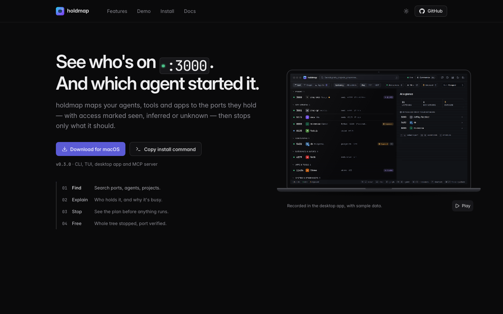
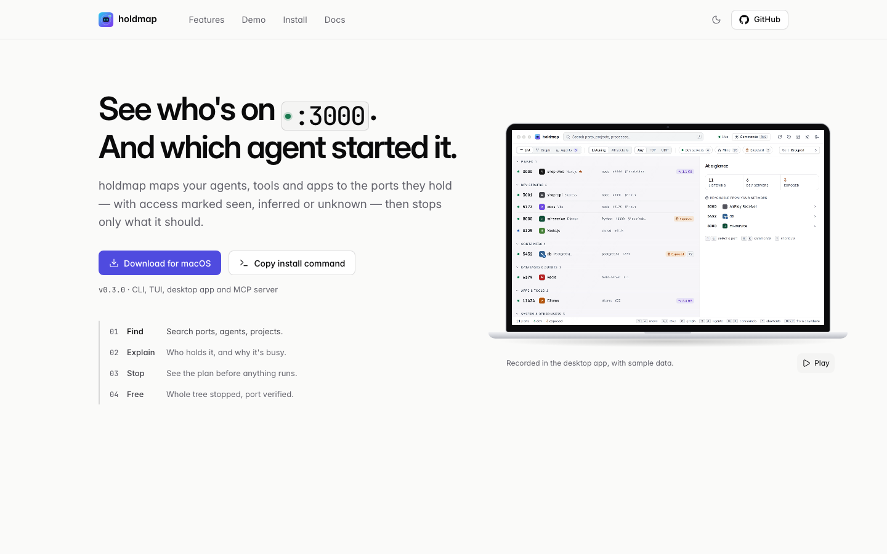
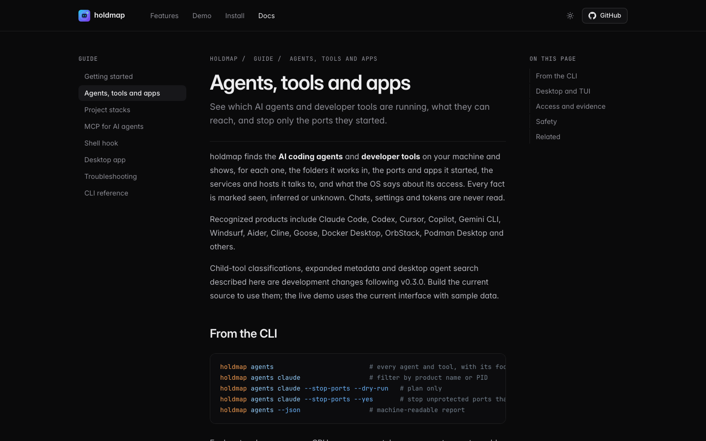
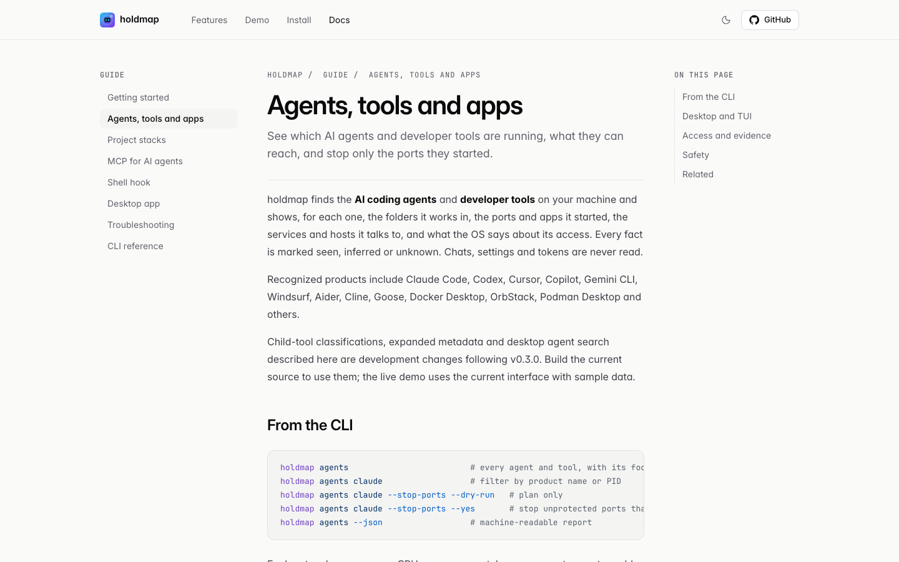
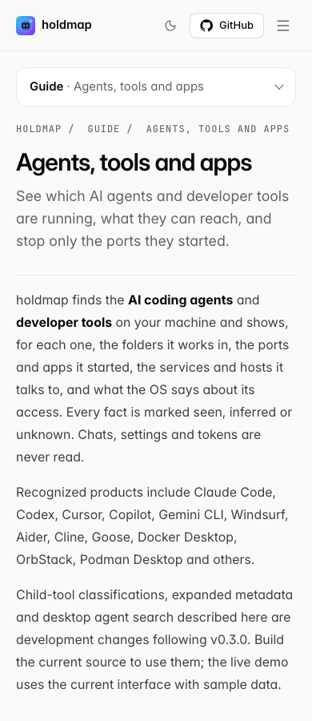

# Public website

The Astro site is published at <https://santoshshinde2012.github.io/holdmap/>.
Canonical URLs, social image URLs and structured-data identities retain the `/holdmap/`
base. The homepage describes the software; guide pages have their own titles and summaries
and a visible breadcrumb trail. Public pages permit large search image previews.
JSON-LD escapes HTML delimiters before insertion into a script.
The schema describes the software without inventing ratings, reviews or release capabilities;
it does not promise a Google software-app rich result.

The sitemap lists the homepage and guide pages. The sample-data demo and 404 page use
`noindex` and are omitted. Crawlers need to fetch these pages to see their `noindex` tags.
GitHub Pages project sites cannot publish the host-root `robots.txt`: a file at
`/holdmap/robots.txt` would not control crawling. The account-level site can advertise
`Sitemap: https://santoshshinde2012.github.io/holdmap/sitemap.xml` in its own `/robots.txt`,
or the sitemap can be submitted directly in Search Console. Search Console submission and
indexing status are separate from this repository's build and deployment.

With Node.js 22.12 or newer, install both the desktop and site dependencies, then run:

```sh
cd apps/desktop
npm ci
npx playwright install chromium
cd ../../site
npm ci
npm run check
HOLDMAP_SITE_OFFLINE=1 npm run build
npm test
npm run test:demo
npm audit --audit-level=low
```

`npm test` checks built links, asset budgets and SEO. `npm run check:seo` checks the static
HTML without executing page scripts: unique metadata, canonical/social URLs, real social
image dimensions, page and breadcrumb schemas, sitemap coverage, noindex exclusions and a
hostile-text JSON-LD regression. It reuses the desktop's locked DOM-parser dependency.
The existing Pages workflow runs `npm test` on pull requests; publishing follows its deployment
policy. Building a pull request does not publish it.

## Website snapshots

These captures show the current website build at 1440×900, with a 390×900 mobile guide
view. The homepage's sample-data recording is paused on its first frame; no machine is scanned.
After building the site, refresh them with `node scripts/capture-screenshots.mjs` from `site/`.
The script manages its own preview server and Chromium, waits for content and fonts, and checks
themes, page errors, overflow and a 600 KB budget for each PNG.

Homepage, dark:



Homepage, light:



Guide and breadcrumb navigation, dark:



Guide and breadcrumb navigation, light:



Mobile guide and breadcrumb navigation, light:



Implementation references: [Google titles](https://developers.google.com/search/docs/appearance/title-link),
[descriptions](https://developers.google.com/search/docs/appearance/snippet),
[canonicals](https://developers.google.com/search/docs/crawling-indexing/consolidate-duplicate-urls),
[breadcrumbs](https://developers.google.com/search/docs/appearance/structured-data/breadcrumb),
[robots.txt location](https://developers.google.com/crawling/docs/robots-txt/create-robots-txt),
[robots metadata](https://developers.google.com/search/docs/crawling-indexing/robots-meta-tag),
and [Astro HTML injection](https://docs.astro.build/en/reference/directives-reference/#sethtml).
